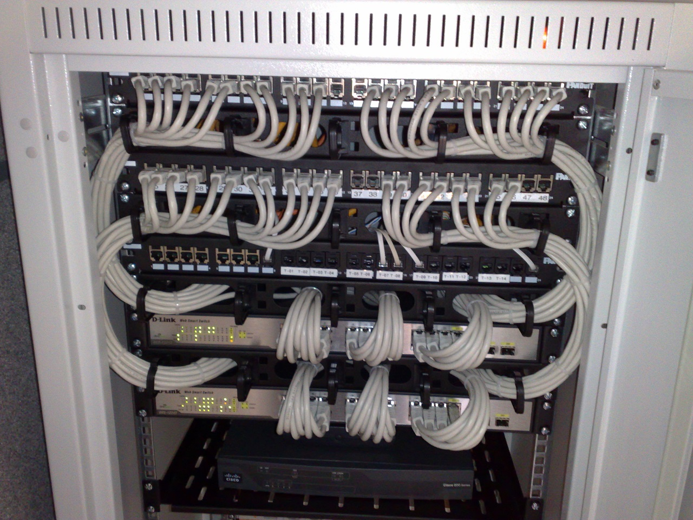

# Table of Contents

1. [Introduction](#intro)
2. [The Basics of networking devices](#basics)
   1. [Cables](#cables)
   2. [Network Devices](#network_devices)
      1. [Hub](#hub)
      2. [Network Switch](#network_switch)
      3. [Routers](#routers)
      4. [Sever and clients](#client_n_server)
3. [TCP/IP 5 layer model](#tcp-ip-5-layer-model)
   1. [Physical layer](#physical-layer)
      1. [Moving bits across a wire](#moving_bits)
      2. [Twisted pair-cabling and duplexing](#duplexing)
      3. [Network Ports and Patch Panels](#network_ports)
         1. [RJ45 plug](#rj45)
         2. [RJ45 port](#rj45_port)
         3. [Patch Panel](#patch_panel)
   2. [Data link layer](#data_link_layer)
      1. [Ethernet and MAC addresses](#ethernet_MAC)
      2. [Unicast, Multicast, Broadcast](#cast)
   3. [Network Layer](#network_layer)
   4. [Transport Layer](#transport_layer)
   5. [Application Layer](#application_layer)
4. [OSI model](#osi)

# Introduction

1. protocol
   * defined set of standards computers must follow to communicate
2. Computer networking
   * full scope of how computers communicate with each other

# Basics of network devices

## Cables

* copper or fiber cables.

1. <u>***Copper Cables***</u>:
   1. most common
   2. copper wires + plastic insulator
   3. voltages changes along these wires, that signals the binary 1's and 0's.
   4. Cat5, Cat5e, Cat6 most common
      1. Cat - category
      2. each has its own specs
      3. Cat5 mostly replaced with Cat5e/Cat6
   5. Cat5e
      1. reduced crosstalk, when compared to Cat5
         1. **Crosstalk**
            * electric pulse on one wire detected *accidentally* on other wire.
            * higher level protocols have methods that detect missing data and "ask for data again", but this increases time of service.
   6. Cat6
      1. more strict specs that Cat5e, hence even lesser crosstalk than it.
      2. more expensive than Cat6
      3. more reliable and faster data transfer than Cat5e
      4. shorter maximum distance, when used at higher speeds, due to internal arrangement of wires 
2. <u>***Fiber Optic Cables***</u> : 
   1. individual optic fiber cables(tiny tubes made out of glass)4
   2. transport pulses of light(1's and 0's), rather than electric signals.
   3. can be used in an area of high electromagnetic interference
      1. this can impact Cu-electric signal data transmission.
   4. usually quicker data transfer than Cu-cables.
   5. much more expensive and fragile.
   6. longer distances, without potential data loss
   7. used more at data-centres, than at offices/home.

## Network Devices

### Hub

* allows connections from many computers at once.
* devices connected to hub able to talk to other devices connected on the same hub.
* 
* **collision domain**
  * network segment where only 1 device can communicate at a time
  * if multiple systems try communicating, then signals can get mixed at the hub
    * this is data collision
    * in such scenario, all workstations have to wait for a period of time, before any one of them can start communicating again
    * this slows down network communications
    * this is the *reason* why *hubs* are *fairly rare.*

### Network switch

* 
* this is actually a layer-2 , i.e. a **data-link layer** device.
* inspect constance of an ethernet protocol data sent around the network, determine which system the data is intended for, send data to that system only.
* reduces/in some cases completely eliminates size of collision domains

### Routers

* hubs and switches primarily used in LAN.
* knows how to forward data between independent networks
* operates at layer-3, i.e. **Network layer device**
* inspects IP data to know to which system to send a particular piece of data.
* stores tables containing information on how to handle traffic between different networks
* most common- home/office routers
  * not much detailed tables
  * forward traffic to ISP(internet service provider)
  * a more sophisticated router at ISP handles, these are referred to as *<u>core ISP routers</u>*
  * core ISP routers make complex decisions on where to send the traffic.
  * connected to a variety of routers
* **Border Gateway Protocol**
  * routers share data via this
  * lets them learn about the most optimal paths to forward the traffic to.

### Servers and Clients

* each client/server - node on the network
  * client - requests for data(can be a node/program running or node)
  * server - provides the requested data(can be a node/program running or node)
* 

# TCP/IP 5 layer model

## Physical Layer

* represents physical devices that interconnect computers
  * includes specs for
    * network-cables
    * connectors that join devices
    * how signals transferred over these devices(cables+connectors)

## Moving bits across the wire

* 1's and 0's sent across a Cu-cable through a process called modulation
* <u>Modulation</u>
  * varying the voltage of a charge moving across a cable.
  * w.r.t. computer networking this is called *line coding*
  * understands that electrical charge in a certain state  0, and in the other state = 1.
    
  * almost 10 billion pulses(bits) every second.

## Twisted Pair Cabling and Duplexing

* pairs of Cu-wires twisted together.
* twisted nature **prevents** signals being carried from **crosstalk** and external **electromagnetic interference**, from neighbouring pairs.
*  
* 4 twisted pairs inside a jacket(black insulation)
* allow duplex communication
  * information flow in both directions across a cable
  * 1-2 pairs of these 4 used for simplex(uni-directional communication), other 2 pairs used for communication is the exact opposite direction
  * hence devices connected can now communicate with each other at the exact same time, this is called **full duplex**
  * if something wrong with the connection, network link degrades reports itself as operating at  <u>half duplex</u> , here the devices on either side of the cable take turns communicating to each other.

## Network Ports and Patch Panels

* all network cables end up in a particular port/plug.
  * this plug exposes each individual wires.

Network ports:

* usually attached to the devices that make up the computer network
* switches have numerous network ports, servers/desktops usually 1/2.

### RJ45 plug

* registered jack, most common
* RJ45 plug 

### RJ45 network port

* this will usually have 2 LED lights - link light and activity light
* link LED will be lit if cable properly connected to a port, and its connected to 2 electrically powered ports on either sides
* activity LED lit up when data actively transmitted across the cable
* on switches, at times the same LED light is used for both
* such a port can usually be found either on cpu/laptop , or mounted in a wall.
* those mounted in a wall(college dorm LAN port) are connected on the other side to a **patch panel** 

## Patch Panel

* as is blatantly visible, this contains many network ports
* container for network port at your college dorm/desk

## Data-Link Layer

1. also known as network-interface or network-access layer.
2. defines a common way of interpreting these signals so network devices can communicate
3. **ethernet** is a protocol that belongs to this layer
   1. it defines protocol that gets data to nodes on the same network or link.
       

## Ethernet and Mac Addresses

*  any other higher layers dont need to care about which network device of the physical layer is being used
  * this layer abstracts all kinds of devices belonging to the physical layer(doesn't matter which cable/port/switch is being used)
* hence the higher layers can now operate independent of the type of network device being used
* this protocol solved the dilemma of collision in hub devices
  * using carrier sense multiple access with collision detection(CSMA/CD).
  * used to determine when communication channels are clear, when a device is free to transmit data.
  * if no data is being transferred at a network segment, a node will be allowed to send out a data
  * if 2 or more computers try sending data at same time, they simply stop sending data
  * each computer that was involved in this collision waits for a random interval of time, before being able to send data.(random interval is used to prevent a repeated collision)
* among a network segment of inter-connected systems, need to identify for which system a particular data transmission was meant for.
  * MAC(media access control) address is used.
  * globally unique identifier attached to a network interface
  * 48 bit number, 6 groupings of 2 hexadecimal numbers, 
  * these addresses can also be represented using Octet(a number represented by 8 bits)
    * 1 hexadecimal number = 4 bits, hence 2 hexadecimal numbers = 1 octet
    * 6 groupings of some octet. = 3 (OUI) + 3 (vendor assigned)

### OUI - Organisationally unique identifiers

* assigned to individual hardware manufacturers by the **Institute of electrical and electronic engineers(IEEE)** 

last 3 octets are assigned by the manufacturer in any way they want.

each possible address should be assigned once(no repetition of the last 3 octets for 2 different devices)

1. ethernet uses MAC addresses to ensure address for both a machine that sends the data and the machine that is intended to receive it.

## Unicast, Multicast, Broadcast

#### Unicast

1. transfer data from 1 device to another device.
2. always meant for 1 receiving address
3. special bit at the destination MAC address is looked.
   1. LSB(1st octet (destination MAC)) = 0, ethernet frame intended only for the destination address.
4. data sent to all devices on the collision domain, but processed only by the one it was meant for.

#### Multicast

* if LSB(1st octet(destination MAC)) = 1
* a multicast frame is similarly set to all devices on the local network signal.
* network interfaces can be configured to accept a list of configured multicast addresses 

#### Broadcast

1. sent to every device on a LAN
2. ethernet broadcast address = FF:FF:FF:FF:FF:FF

## Dissecting an Ethernet Frame

**Data packet**

1. single set of *binary* data sent across a network link
2. at ethernet level = ethernet frames

### Ethernet Frame

1. highly structured information presented in a specific order
2. network interfaces at physical layer able to convert pulses into meaningful data.
3. all sections mandatory, most of these sections have a fixed size.
4. 

#### Preamble

1. 1st 7 bytes = series of alternating 1's and 0's
   1. buffer between frames
   2. network interfaces use them to synchronize internal clocks that regulate their speed of data transmission.
2. last byte - SFD(start frame delimiter)
   1. signals that preamble is over, actual frame contents are to follow.

#### Destination address

1.  intended recipient's MAC(6 bytes = 48 bits)

#### Source address 

1. frame originated from which MAC(6 bytes = 48 bits)

### VLAN tag/header

1. indicated that the frame itself is a VLAN(**virtual LAN**) frame
2. if this is present, an EtherType immediately follows it
3. multiple logical LANs on same physical devices.
4. a network switch that is configured to relay a specific VLAN tag will deliver only those ethernet frames with this tag.
5. VLANs used to segregate different forms of traffic
   1. a company's phones operate on 1 VLAN, desktops(workstations) operate on another VLAN.

#### Ether Type field

1. describe protocol of the contents of the frame

### Payload

1. actual data being transferred

### FCS

1. Frame Check Sequence
2. checksum value for entire frame
   1. obtained from calculating *cyclical redundancy check*(CRC , polynomial function) against the frame.
   2. CRC against the same data should give the same checksum value
3. used by the recipient to infer whether data was *corrupted* or not.
   1. receiving side performs a CRC to check whether data was corrupted, while being transferred across the link.

## Network Layer

* also known as the *internet* layer
* allows different networks to communicate with each other using devices called *routers*.
* **Internetwork** - collection of networks interconnected through routers.
  * for eg. the internet
* data delivered across a collection of networks.
* most common protocol at this layer - **IP(internet protocol)**
* network software = Client + Server
  * client initiates request for data
  * server answers request, fetches some data aptly.

### IP-address

1. 172.16.254.1 - 32 bit or 4 bytes , each of these dot-separated numbers represented as 8 bits
   1. hence if any of these 4 numbers is > , then that is an invalid ip address.
   2. this notation = dotted decimal notation
2. distributed to companies, rather than manufacturers/hardware vendors
   1. more hierarchical , easier to sort data about
   2. for instance, IBM owns everything that has its IP's  1st decimal as 9
   3. thus if a router has to deliver a packet to 9.0.0.1, then it has to deliver this to any IBM router, and then this IBM router will take over.
3.  thus  laptop = permanent MAC, but variable IP(depending upon the network its connected to)
4. LAN at home/internet cafe responsible for handing over an IP address to your laptop
   1. similarly how at CCNSB lab, each port
   2. automatic assigning of this IP address to a connected system - DHCP(dynamic host configuration protocol), an IP address assigned in this fashion - *dynamic IP address*
      1. assigned to clients(laptops/phones etc devices that connect)
   3. static IP - configured on a node manually
      1. reserved for network devices and servers

## IP Datagrams 

1. data-packets at the network layer
   
2. ver = version(4 bits) 
   1. what protocol is being used 
      1. version 4 = IPv4
      2. version 6 - IPv6
3. Header-length = 4 bit long
   1. tells length of the header field
   2. value is always 20 bytes(length of header = 20 bytes) when dealing with IPv4
      1. 20 B minimum length of an IP header
4. Service type field
   1. 8 bits -details about QoS(quality of service), technologies etc.
   2. services that allow routers to know which IP-datagams are more important than others.
5. Total Length
   1. 16 bits, indicate total length of this IP datagram
   2. hence, max size of datagram = 
   3. if data is even larger, IP layer splits the data being sent into packets
6. Identification field
   1. 16 bits
   2. used to group messages together
   3. if, as mentioned above, data is split into packets, this field is used so that the recipient understands every packet with the same value in this field is part of the same data being transmitted.
      1. hence, whichever packets(IP-datagrams) have the same identification field value belong to the same data.
7. Flag field
   1. indicate whether data is allowed to fragment
   2. indicate whether data has been fragmented.
8. Fragmentation
   1. split a single IP-datagram into multiple smaller datagrams
   2. network might allow different sized-datagrams to pass through
      1. hence if a large datagram enters a network where shorter datagrams are allowed only, this would be fragmented .
      2. fragmented offsets thus used
      3. this is used by the recipient to put all fragments datagrams together
9. TTL - time to live
   1.  8 bits
   2. number of router-hops a datagram can traverse before its thrown away.
   3. every time a datagram reaches a new router, this router reduces its TTL value by 1.
      1. once value = 0, no need to forward this further
   4. misconfig in routing which leads to an infinite loop, datagrams don't spend infinite time roaming around various networks.
      1. infinite loop = for eg. router A thinks router-B is the next hop, router-B thinks router-A is next hop
10. Protocol
    1. 8 - bits
    2. which transport-layer protocol is being used.
11. Header Checksum
    1. checksum of entire contents of the datagram header.
    2. changes at every site where TTL field gets modified, i.e. entry into every new router.
12. Source & destination IP-address
    1. 32-bits each
13. IP options field
    1. characteristics primarily used for testing purposes.
    2. might be padded with 0's until this options+padding field reaches 32-bit length.
14. Data field
    1. variable length field
    2. carries actual data

Entire contents of an IP-datagram are ***encapsulated*** as the payload of an ethernet frame.

datagram has a payload section = TCP/UDP packet contents

## Encapsulation

## Transport Layer

* sorts out which client/server programs are to receive the data.
* for eg. from ur device(laptop) multiple apps opened, for eg facebook.com, instagram.com , hence your laptop has multiple-clients, and their respective servers might run on the same server.
  * the request for facebook(for instance, posting a meme on a particular group) and request for following someone on instagram ends up exactly in their apt client spaces, i.e. request for instagram isn't received by the facebook client or vice-versa.
* TCP - transmission control protocol used.
  * provides mechanisms to ensure data is reliably delivered to the apt client/server.
* UDP - user datagram protocol.

## Application Layer

* application specific
* for instance, browsing sites - HTTP/HTTPS

# OSI model

* 7 layers