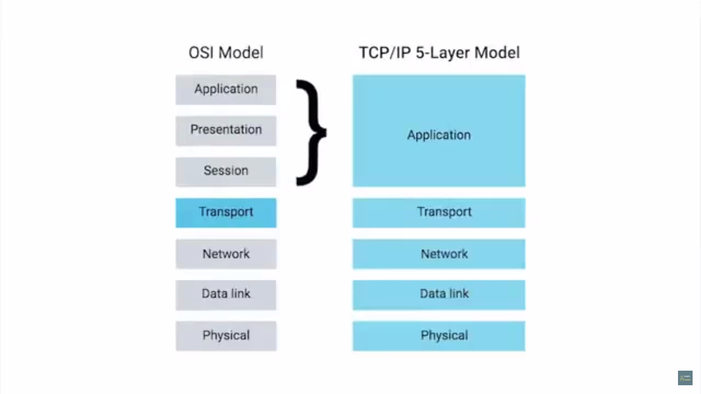
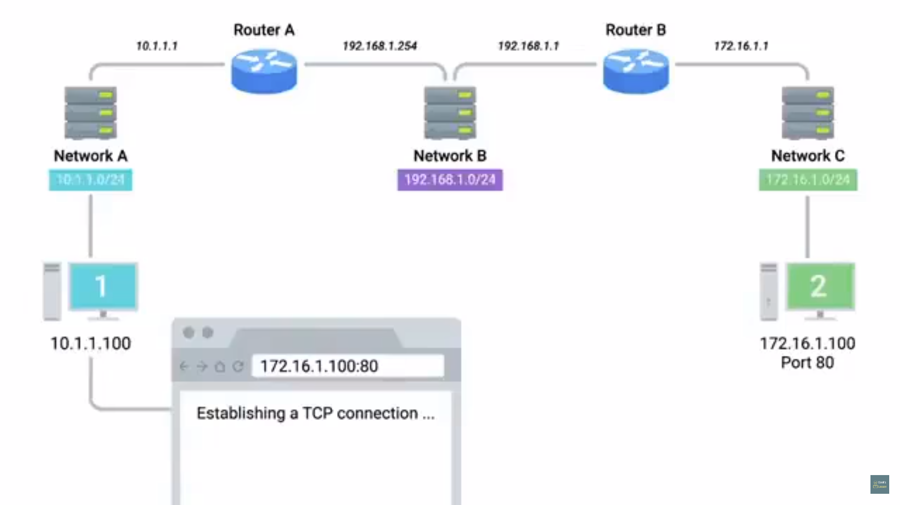

# Table of Contents

1. [Introduction](#intro)
2. [OSI model](#osi)
3. [All layers together](#all)

# Introduction

* application protocols like HTTP, HTTPS, SMTP etc standardised across various application types

* browsers such as chrome, firefox, safari need to speak the same protocol
* web-servers such as Microsoft IIS, Apache and nginx  need to speak the same protocols
* web traffic protocol - HTTP

# OSI model

1. open systems interconnection
2. used by academic settings or various network certificate organisations
3. 7 layers
   
4. Session layer
   1. facilitates comms between actual apps and transport layer
   2. takes application data(main payload), *unencapsulated* , hands it off to presentation layer
5. Presentation Layer
   1. responsible for making sure that unencapsulated app layer data is able to be understood by the app in question
   2. this is where the OS comes in, it might handle encryption-decryption of data or compression-uncompression of data
6. the app layer of TCP/IP 5-layer model == App-layer + presentation layer + session layer of the OSI  model.

# All layers together

1. 
2. network address spaces(IP) and interface IP's shown above
3. computer-2 = server at a data-center, has a web-server listening at port 80
4. computer-1 , i.e. client, requests for 172.16.1.100 , i.e. the server 