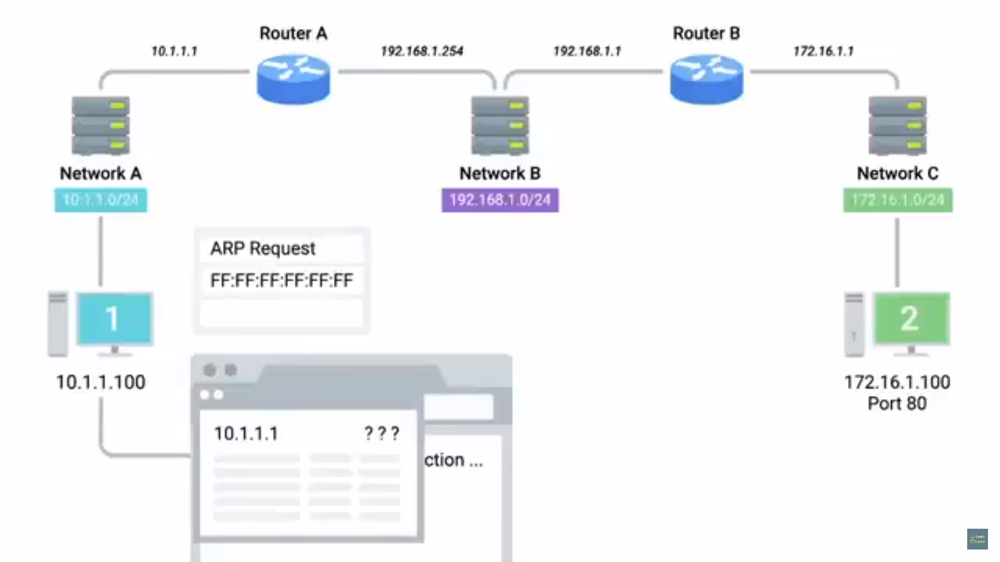
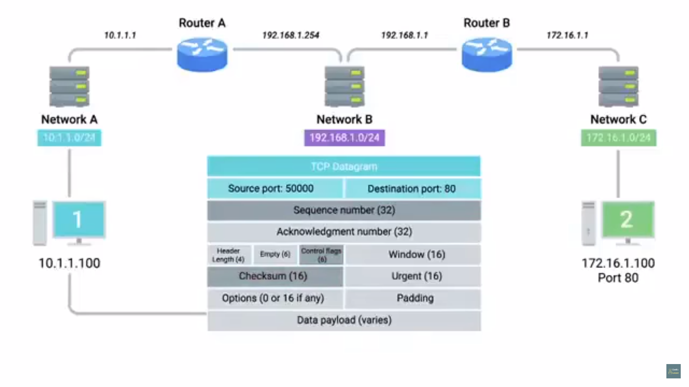
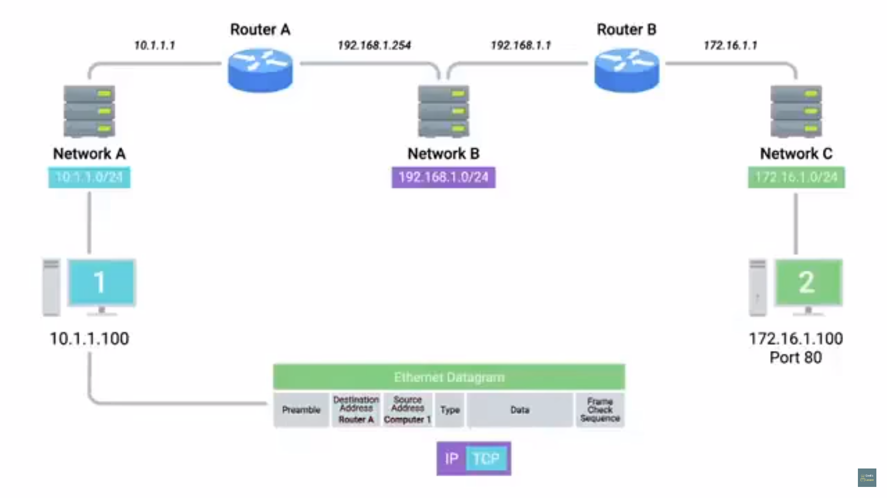
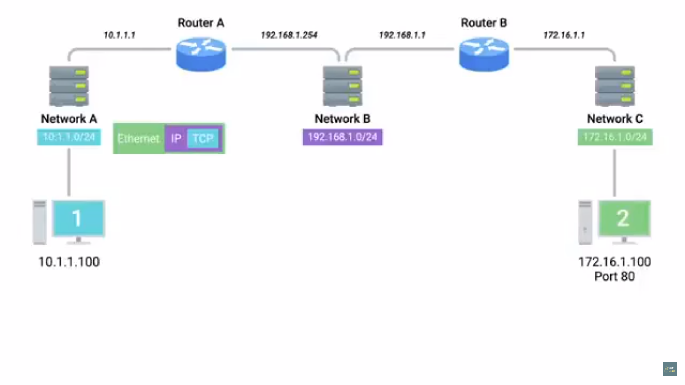
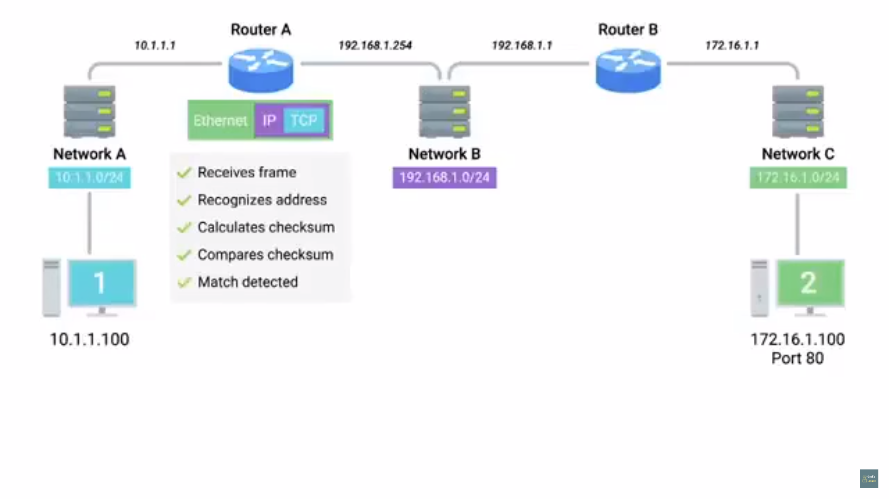

# Table of Contents

1. [Introduction](#intro)
2. [OSI model](#osi)
3. [All layers together](#all-layers)

# Introduction

* application protocols like HTTP, HTTPS, SMTP etc standardised across various application types

* browsers such as chrome, firefox, safari need to speak the same protocol
* web-servers such as Microsoft IIS, Apache and nginx  need to speak the same protocols
* web traffic protocol - HTTP

# OSI model

1. open systems interconnection
2. used by academic settings or various network certificate organisations
3. 7 layers
   
4. Session layer
   1. facilitates comms between actual apps and transport layer
   2. takes application data(main payload), *unencapsulated* , hands it off to presentation layer
5. Presentation Layer
   1. responsible for making sure that unencapsulated app layer data is able to be understood by the app in question
   2. this is where the OS comes in, it might handle encryption-decryption of data or compression-uncompression of data
6. the app layer of TCP/IP 5-layer model == App-layer + presentation layer + session layer of the OSI  model.

# All layers together

1. 
2. network address spaces(IP) and interface IP's shown above
3. computer-2 = server at a data-centre, has a web-server listening at port 80
4. computer-1 , i.e. client, requests for 172.16.1.100 , i.e. the server
   1. web browser on client knows request for the above address, communicates with the local networking stack(part of the OS concerned with networking functions), web browsers wants to establish a TCP connection with this 172.16.1.100:80.
   2. the networking stack then examines its own subnet to see whether the requested IP belongs to the same subnet or not, and since 172.16.1.100:80 doesn't exist in the network 10.1.1.0/24 ,  realises the requested connection resides in some other network 
   3. hence the computer-1 knows that it has to send the request(data) to its gateway router for routing to a remote network, and its(comp-1's) gateway is configured as 10.1.1.1
   4. comp-1 looks at its ARP table to see what MAC address does 10.1.1.1(its gateway router) corresponds to , but it does not find any entry
   5. it then issues an ARP request(broadcast message, FF:FF:FF:FF) for an IP = 10.1.1.1 , this request is sent to every node on its local network(10.1.1.0/24)
      
   6. when router-A receives this ARP message, it sees that its IP is being requested, and as a response sends it MAC address(00:11:22:33:44:55) to comp-1
   7. comp-1 receives now knows the MAC of its gateway, thus starts preparing its outbound packet
   8. comp-1 knows that its being asked by its web-browser to form a TCP connection (with router-A), hence it would need a TCP port 
   9. its OS recognises an ephemeral port 50,000 as being available, thus opens a socket connection between the web browser and this port. 
   10. networking stack has to create a TCP segment as part of establishing the TCP connection
       1. source port = 50000, destination port = 80
       2. SYN=1, checksum calculated and stored in the checksum field for this segment.
       3. 
   11. this TCP segment is now passed to the IP layer, where a datagram will have this segment as its payload
       1. for this datagram source IP = 10.1.1.100,  destination IP = 172.16.1.100
       2. TTL = 64(standard value)
       3. checksum calculated for this datagram and stored in its checksum field
       4. 
   12.  now an ethernet frame is constructed
       1. with payload as the entire IP datagram
       2. source MAC = MAC(comp-1), destination MAC = 00:11:22:33:44:55
       3. FCS(checksum for the frame) computed, stored in its checksum field
       4. 
5. the constructed ethernet frame is ready to be sent via the physical layer to the router-A(its interface for network A)
   1. the ethernet frame is sent in the form of modulations in electric pulses along the Cat6 cables that connect comp-1 with the network switch for network A
      
   2. this switch then inspects the ethernet frame contents for its destination MAC, it knows to which of its interfaces the destination MAC address is attached to, forwards the frame via the cable that connects the switch to this interface(10.1.1.1). 
      
   3. router A, on receiving the frame , recognises that the request is for its own MAC, calculates FCS , compares to validate, and detects match(if the data didn't get tampered with)
6. now, router-A strips away the ethernet-header off the ethernet-frame, leaving just the IP-datagram
   1. checksum calculated for this datagram, matched with the one stored inside
   2. inspects destination IP, looks it up in its routing table and sees that the quickest path to send data to network-C is via network-B 
   3. it then reduces TTL by 1, calculates new checksum(that reflects this reduced TTL value), and makes a   
   4. this router knows that it has to send to router-B, at its interface of 192.168.1.1, hence it looks at its ARP table and sees that it has an entry for this IP
      1. then router-A constructs an ethernet-frame with source MAC = router-A's interface at network-B MAC , destination-MAC = MAC(router-B 's interface at network-B )
      2. checksum calculated with theses fields, sends the frame to network B
7. this frame is now received by router-B
   1. the ethernet frame is sent in the form of modulations in electric pulses along the Cat6 cables that connect router-A's network-B interface with the network switch for network B
   2. this switch then inspects the ethernet frame contents for its destination MAC, it knows to which of its interfaces the destination MAC address is attached to, forwards the frame via the cable that connects the switch to this interface(192.168.1.1).
8. on receiving the frame, router-B
   1. strips away the ethernet-header off the ethernet-frame, leaving just the IP-datagram
   2. checksum calculated for this datagram, matched with the one stored inside
   3. inspects destination IP, looks it up in its routing table and sees that it is connected on a local network(router-B has an interface with network-C ) 
   4. it then reduces TTL by 1, calculates new checksum(that reflects this reduced TTL value), and makes a   
   5. a new ethernet-frame is constructed, with destination MAC of server(comp-2), source MAC of router-B.
   6. checksum computed and stored
9. switches at network C ensures that frame is delivered to comp-2
10. comp-2 identifies the destination MAC of the frame as its own, hence knows that the frame was meant for itself.
    1. it then strips off the frame-header, a CRC is performed to check whether data is intact
    2. recognises destination IP as its own
    3. its strips away the IP datagram, leaving only the TCP segment
    4. checksum examined, matched
    5.  destination port = 80, the network stack on comp-2 checks to ensure if there is any open socket opened at this port 
    6. this socket is at the LISTEN state, held open by an Apache web server
    7. comp-2 sees that this segment has SYN=1, sequence number examined and stored as it will need this sequence number as an acknowledgement number in its response

* this entire procedure was just for the SYN stage , among the 3-way handshake
* it is repeated for all the other stages(SYN/ACK, ACK, ESTABLISHED)