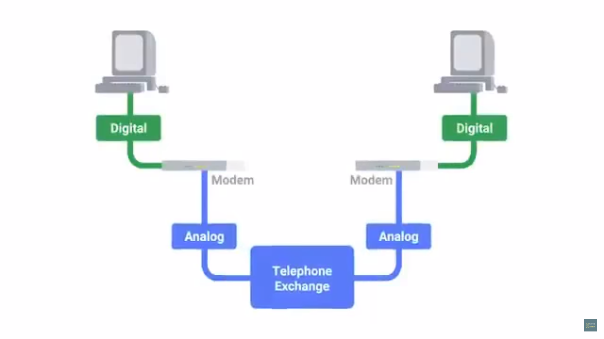

# Table of Contents

1. [POTS and Dial up](#pots)
   1. [Dial-up, Modems and Point-to-Point Protocols](#modems)
2. [Broadband](#broadband)
   1. [T-carrier technologies](#t-carrier)

# POTS and Dial-up

## Dial-up, Modems and Point-to-Point Protocols

1. Plain Old Telephone Service(POTS)
   1. inspiration of the first network architecture from public switched telephone network
   2. phone lines to transfer data
   3. USENET was developed
2. Dial-up connection
   1. uses POTS for data transfer
   2. connection is established by actually dialling a phone number
   3. 
   4. Modem = MOdulator/DEModulator
      1. turn data understood by computer into audible wavelengths that can be transmitted over POTS
   5. earlier modems had *very low Baud rates*
      1. measurement of bits that can be passed across the phone line per second
      2. in earlier 1950s speed &approx; 110bps
   6. USENET - 300 bps
   7. when dial-up became a household commodity, early 1990s 14.4 kbps

# Broadband

1. connections are long-lasting
   1. don't need to be established again and again after each use, unlike dial-up
   2. 
      this is for dial-up

## T-carrier technologies

1. developed by AT&T in order to transmit multiple phone calls over a single link
2. require dedicated lines hence making them more expensive(cannot be general purpose in use), thus used majorly by businesses