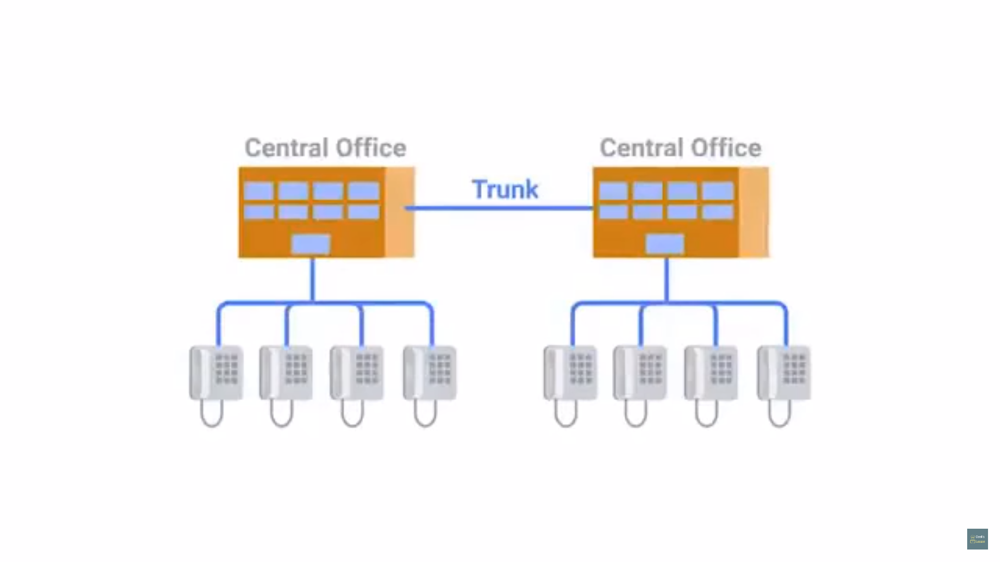
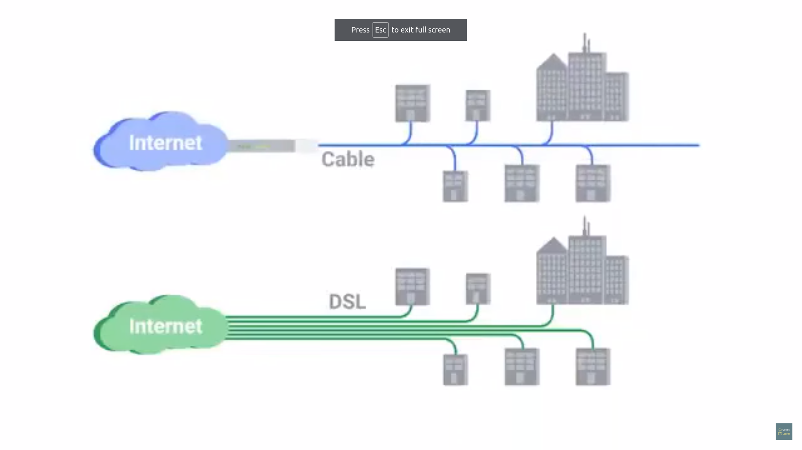
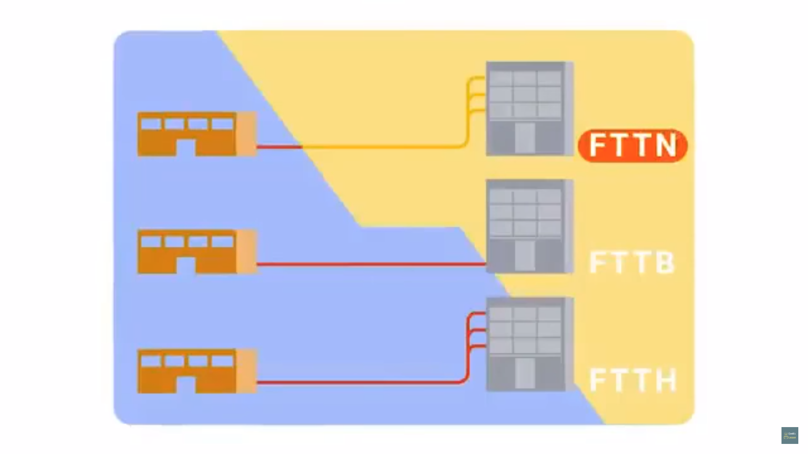
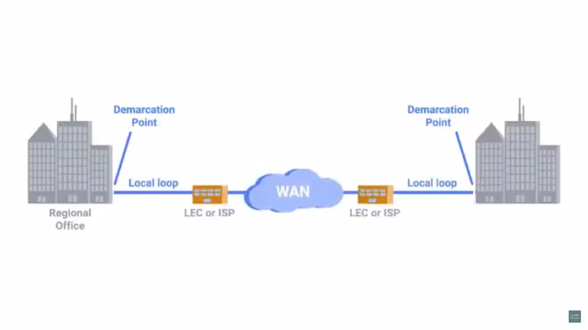
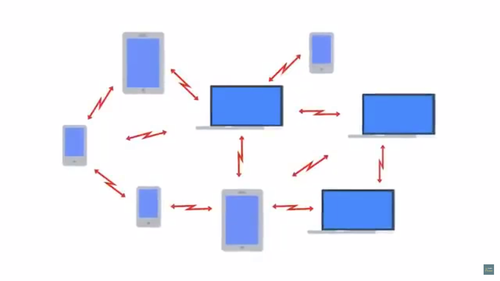
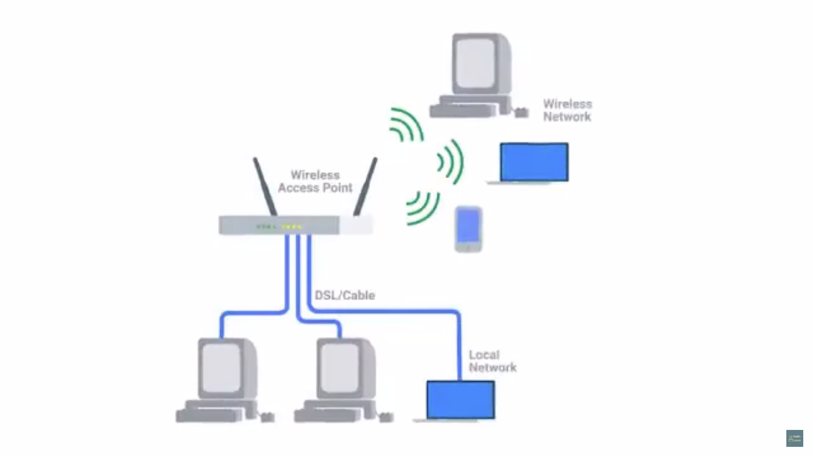
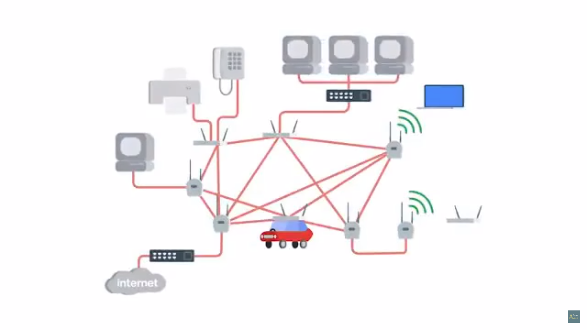
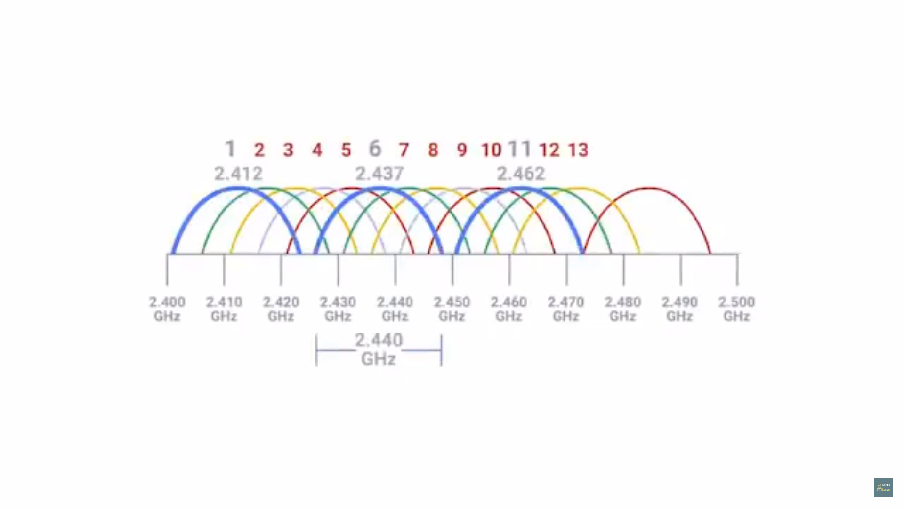
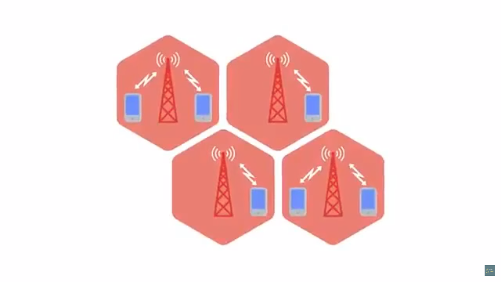

# Table of Contents

1. [POTS and Dial up](#pots)
   1. [Dial-up, Modems and Point-to-Point Protocols](#modems)
2. [Broadband](#broadband)
   1. [T-carrier technologies](#t-carrier)
   2. [Digital Subscriber lines](#dsl)
   3. [Cable broadband](#cable-broadband)
   4. [Fiber connections](#fiber)
      1. [FTTX](#fttx)
      2. [FTTN](#fttn)
      3. [FTTB](#fttb)
      4. [FTTH](#ftth)
3. [WAN](#wan)
   1. [WAN technologies](#wan-tech)
   2. [Point to point VPN](#ppvpn)
4. [Wireless networking](#wn)
   1. [802.11 frame](#802.11frame)
   2. [Wireless network config](#wnc)
      1. [Ad-hoc nets](#adhoc)
      2. [WLANs](#wlan)
      3. [Mesh nets](#mesh)
   3. [Wireless Channels](#wc)
   4. [Wireless Security](#ws)
      1. [WEP](#wep)
      2. [WPA](#wpa)
      3. [WPA2](#wpa2)
      4. [MAC Filtering](#mac-filtering)
   5. [Cellular networking](#cell)

# POTS and Dial-up

## Dial-up, Modems and Point-to-Point Protocols

1. Plain Old Telephone Service(POTS)
   1. inspiration of the first network architecture from public switched telephone network
   2. phone lines to transfer data
   3. USENET was developed
2. Dial-up connection
   1. uses POTS for data transfer
   2. connection is established by actually dialling a phone number
   3. 
   4. Modem = MOdulator/DEModulator
      1. turn data understood by computer into audible wavelengths that can be transmitted over POTS
   5. earlier modems had *very low Baud rates*
      1. measurement of bits that can be passed across the phone line per second
      2. in earlier 1950s speed &approx; 110bps
   6. USENET - 300 bps
   7. when dial-up became a household commodity, early 1990s 14.4 kbps

# Broadband

1. connections are long-lasting
   1. don't need to be established again and again after each use, unlike dial-up
   2. 
      this is for dial-up

## T-carrier technologies

1. developed by AT&T in order to transmit multiple phone calls over a single link
2. require dedicated lines hence making them more expensive(cannot be general purpose in use), thus used majorly by businesses
3. eveyr call made on pairs of Cu wires before Transmission System 1, 1st T-carrier specs, called T-1
4. with this T-1, 24 calls could be carried over a single pair of Cu wires
5. after repurposing this for data transfer, each of these 24 channels could transfer data at 64kbps, hence a single T-line could carry data at 64&times;24 = 1536kbps or 1.536 Mbps
6. later on, any twisted pair of Cu cables able to transmit at 1.544 Mbps = T-1
7. multiple T-1 lines act as a single-link = T-3 , which had 28  T-1 lines, hence speed = 44.736 Mbps

## Digital Subscriber lines

1. data transfer through twisted pair Cu cables was found to be much larger in volume than needed for voice-to-voice comms in dial-up
2. operating at a frequency range that didn't interfere with phone calls
3. this allowed calls and data transfer to occur on the same line at the same time(no intereference from one another)
4. modems = DSLAMs = digital subscribler line access multiplexers
5. connections have more life than dial-up ones
6. 2 most common DSL - ADSL, SDSL
   1. ADSL - asymmetric dsl
      1. different speeds for outbound and incoming data, hence faster downloads, slower uploads
      2. more popular in typical home users, at a lower cost
   2. SDSL - symmetric dsl
      1. same speeds for upload/download
      2. was used primarily by businesses to send data to clients
      3. 1.544 Mbps - upper cap
7. HDSL - high bit-rate DSL, speed > 1.544 Mbps

## Cable broadband

1. this started with actually making TV from wireless to wired
2. just as there are cellphone towers now, there used to be TV towers, for TV data comms
3. but to increase the reach to rural and remote areas, which were not covered by the range of these towers, TV comms was shifter to a cable, wired approach
4. 1994 Cable Communications Policy Act 
   1. deregulation of cable TV business in USA, hence massive growth and adoption of cable TV
5. cable providers saw ways to join the massive spike in internet growth
6. coaxial cables, that was used for transmitting cable-TV data, was able to transfer much more data than required for TV viewing
7. again, by using frequencies that don't interfere with TV broadcast, cable based internet tech able to deliver high speed internet across the same cables
8. this is generally known as ***shared bandwidth technology***
   1. connection to a dial-up ot DSL went straight to a *central office(CO)* from home/office
   2. office staff used switchboards in these CO's to manually connect caller to the callee, and were soon replaced by automated hardware
   3. 
   4. 
      shared bandwidth in case of cable broadband
   5. users share a certain bandwidth until ISP's core router is reached, hence the speed will decrease during periods of heavy use
9. **cable modem** usually manages the cable broadband internet connections
   1. CMTS - cable modem termination system, connects lots of different cable connections to an ISPs core network

## Fiber connections

for a longer time, used by ISPs within their core network, or within data-centers, since laying optical fibers was very expensive

### FTTX

* FTTX - fiber to the X

#### FTTN

* fiber to the neighbourhood
* 
* single physical cabinet that serves certain amount of population
* from this cabinet, twister-pair Cu/Coaxial cables used for last length of the distance

#### FTTB

* fiber to the building/basement/business
* cables to the building physically enter
* data delivery to an individual building
* twisted Cu used to connect these to systems inside of the building

#### FTTH

* fiber to the home
* fiber is run for each resident in an apartment/home

FTTH & FTTB = FTTP(fiber to the premises)

instead of a modem, the demarcation here is called a Optical Network Terminator(ONT)

* converts data from protocols the fiber network can understand(light intensitites) to those that more traditional, twisted-pair Cu networks can understand(electric pulses)

# WANs

## WAN tech

1. suppose 1 office----> 2 offices, hence a population equal to a new office needs connection to your company's network
   1. initially, when it was just one office, routing to non-routable address spaces(since IPs are scarce and expensive), routers for NAT, usage of DHCP servers and DNS servers for making network config easier, VPN(via port forwarding) for employees of they aren't connected to the office net directly was doing the job, contract with an ISP to deliver a link to the internet for this office
   2. hence WAN comes here
2. spans across multiple physical locations
3. contract a link with ISP to send data from one location to another, and the ISP will handle this distant-locations data transfer
4. 
5. the local loop = T-carrier line or high speed optical connection to the ISP's local regional office and from there this would be connected to the ISP's core network
6. WAN protocols usually at the data-link layer, different from the traditionally know Ethernet protocol

## Point-to-Point  VPNs

1. clouds let companies outsource all/various parts of their infrastructure for other companies to manage
2. by such outsourcing, no longer extremely high speed connections required, thus making WAN expenses  totally unnecessary
3. this is used so that its a company's sites(physical location) can communicate with each other
4. also known as a site-to-site VPN, establishes a VPN tunnel between 2 sites(locations, such as 2 offices), tunneling is handled by network devices, rather than the users configuring their computers everytime they want to access
5. 

# Wireless networking

1. most common specs for wirless data transmission - IEEE 802.11 standards
   1. set of techs that follow this = WiFi, which is pun on the word hi-fi , meaning high fidelity , used for high-quality audio tech, *<u>common misconception that wireless fidelity is the expanded form</u>*
2. frequency band - certain section of radio section agreed to be used for certain comms
   1. WiFi - comms via radio-waves
   2. in North America = FM = 88-108MHZ(FM broadcast band)
   3. 2.4Ghz and 5Ghz band is for WiFi(not in between, this isn't the range)
3. 802.11a, 802.11b, 802.11g, 802.11n, 802.11ac are the other standards used for wireless transmission
4. 802.11 protocols = how to operate at physical and data-link layers

## 802.11 frame

1. an **802.11 frame**(just like an ethernet frame), has certain fields
   
2. frame-control = 16 bits long, info about how the frame should be processed, for instance which of the 802.11 versions was used(a/b/g...)
3. duration or ID - how long the total frame is, so that the receiver knows how long to listen to the transmission for
4. 4 addresses
   1. **Wireless access point**
      * device that bridges the wireless and wired portions of a network
      * devices usually associated with the physically closes point(could also be determined by general signal strength and wireless interference)
   2. Address-1 = MAC of sender
   3. Address-2 = MAC of intended destination
   4. Address-3 = receiving MAC(of the access point that receives this 802.11 frame)
   5. Address-4 = transmitter address(of the access point that receives this 802.11 frame)
   6. in many situations Address-3 = Address-4
5. sometimes wireless access points will relay these frames from one to the other(Why?)
6. sequence-control = sequence number to keep track of the order of frames
7.  payload = 0B - 7951B
8. FCS - cyclical redundancy check

## Wireless Network Config

### Ad-hoc nets

1. all nodes speak directly to each other
2. 
3. smartphones could establish ad-hoc nets with other smartphones
4. used in industrial/warehouse setting, where *smart devices that could communicate with each other* might by required
5. powerful during natural disaster

### WLAN

1. wireless LANs
2. 1 or more access points act as a bridge between a wireless and wired network
3. most common in business networks
4. 
5.  wired = DSL/cable, 
6. for accessing resources outside of this WLAN(network the devices are connected to), computers have to  request to these access points which then forward the traffic to the gateway router

### Mesh nets

1. hybrid of adhoc and wlan
2. 
3. mostly made of wireless access points, still be connected to a wired network
4. 

## Wireless Channels

1. individual smaller sections of the overall frequency band used by a wireless network
2.  collision domain - network segment where a computer can interfere another
   1. when 2 or more transmissions occur at the same time, stop and wait for random amount
3. since no cables, no switches for wireless networking , unlike cables, which had switches as interfaces to prevent this collision domain problem, by remembering which computers live on which physical interfaces, thereby sending node to the traffic its intended for
4. channels fix this <u>to a certain extent</u>
5. 2.4GHz = 2.4-2.5GHz range
   1. x  total channels, each with some width
   2. this x depends on which country , since the regularoty committees of that company will decide number of channels for this range
   3. 802.11b, width = 22 MHz(0.022 Ghz) channel 1 operates at 2.412 GHz, and the signal lives in 2.401GHz - 2.423 GHz, since radio waves are to be imprecise, hence a buffer is needed.
   4. 
      some channels overlap, others are far-part to not interefere with each other
      hence channel 1(midpoint = 2.412 GHz) completely isolated from channel 6(midpoint = 2.437 GHz), both coloured in blue
6. today's wireless equipment made to autosense what channel is most congested 
7. some access points will perform this check when they start-up, others will do it dynamically
8. avoid collision domains wherever possible
   1. hence overlap of channels between access points of different businesses' networks is as small as possible

## Wireless Security 

1. wired-link transfer have an inherent security, since only the nodes at the either ends of a network-link know what data is being transferred
2. since many devices can be in close proximity to the communicating nodes, any other node could intercept comms(since its radio-waves at the end of the day)

### WEP

1. wired equivalent privacy
2. encryption tech that provides *very low level* privacy
3. 40 bits for encryption keys
   1. with modern computers, hacked in just few minutes

### WPA

1. WiFi protected access
2. quickly replace wep
3. 128 bit key

### WPA2

1. update to WPA
2. 256 bits for encryption key

### MAC filtering

1. configure access points to only allow connections from a apecific set of MAC addresses belonging to devices you trust 
2. prevents unauthorised devices from connecting to the wireless network itself

## Cellular Networking

1. lots of cellular net specs, just like wireless net specs
2. also operates over radio waves, has frequency bands, these can travel over long distances(longer wavelengths) more easily than wireless(several km / miles)
3. built around the concept of cells
   1. each cell is assigned a specific frequency for use
   2. 
   3. neighbouring cells setup to use bands that dont overlap
   4. the cell towers can be thought of as access points with a much larger range