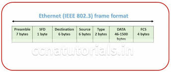

# Table of Contents

1. [Ethernet and MAC addresses](#ethernet_MAC)
   1. [OUI](#oui)
2. [Unicast, Multicast, Broadcast](#cast)
3. [Dissecting an ethernet frame](#dissecting_ethernet_frame)
   1. [preamble](#preamble)
   2. [destination address](#dest_add)
   3. [source address](#source_add)
   4. [vlan tag/header](#vlan_tag)
   5. [Ether type field](#ether_type_field)
   6. [Payload](#payload)
   7. [FCS](#fcs)

# Ethernet and Mac Addresses

*  any other higher layers dont need to care about which network device of the physical layer is being used
   * this layer abstracts all kinds of devices belonging to the physical layer(doesn't matter which cable/port/switch is being used)
*  hence the higher layers can now operate independent of the type of network device being used
*  this protocol solved the dilemma of collision in hub devices
   * using carrier sense multiple access with collision detection(CSMA/CD).
   * used to determine when communication channels are clear, when a device is free to transmit data.
   * if no data is being transferred at a network segment, a node will be allowed to send out a data
   * if 2 or more computers try sending data at same time, they simply stop sending data
   * each computer that was involved in this collision waits for a random interval of time, before being able to send data.(random interval is used to prevent a repeated collision)
*  among a network segment of inter-connected systems, need to identify for which system a particular data transmission was meant for.
   * MAC(media access control) address is used.
   * globally unique identifier attached to a network interface
   * 48 bit number, 6 groupings of 2 hexadecimal numbers, 
   * these addresses can also be represented using Octet(a number represented by 8 bits)
     * 1 hexadecimal number = 4 bits, hence 2 hexadecimal numbers = 1 octet
     * 6 groupings of some octet. = 3 (OUI) + 3 (vendor assigned)

## OUI - Organisationally unique identifiers

* assigned to individual hardware manufacturers by the **Institute of electrical and electronic engineers(IEEE)** 

last 3 octets are assigned by the manufacturer in any way they want.

each possible address should be assigned once(no repetition of the last 3 octets for 2 different devices)

1. ethernet uses MAC addresses to ensure address for both a machine that sends the data and the machine that is intended to receive it.

# Unicast, Multicast, Broadcast

## Unicast

1. transfer data from 1 device to another device.
2. always meant for 1 receiving address
3. special bit at the destination MAC address is looked.
   1. LSB(1st octet (destination MAC)) = 0, ethernet frame intended only for the destination address.
4. data sent to all devices on the collision domain, but processed only by the one it was meant for.

## Multicast

* if LSB(1st octet(destination MAC)) = 1
* a multicast frame is similarly set to all devices on the local network signal.
* network interfaces can be configured to accept a list of configured multicast addresses 

## Broadcast

1. sent to every device on a LAN
2. ethernet broadcast address = FF:FF:FF:FF:FF:FF

# Dissecting an Ethernet Frame

## **Data packet**

1. single set of *binary* data sent across a network link
2. at ethernet level = ethernet frames

## Ethernet Frame

1. highly structured information presented in a specific order
2. network interfaces at physical layer able to convert pulses into meaningful data.
3. all sections mandatory, most of these sections have a fixed size.
4. 

### Preamble

1. 1st 7 bytes = series of alternating 1's and 0's
   1. buffer between frames
   2. network interfaces use them to synchronize internal clocks that regulate their speed of data transmission.
2. last byte - SFD(start frame delimiter)
   1. signals that preamble is over, actual frame contents are to follow.

### Destination address

1.  intended recipient's MAC(6 bytes = 48 bits)

### Source address 

1. frame originated from which MAC(6 bytes = 48 bits)

### VLAN tag/header

1. indicated that the frame itself is a VLAN(**virtual LAN**) frame
2. if this is present, an EtherType immediately follows it
3. multiple logical LANs on same physical devices.
4. a network switch that is configured to relay a specific VLAN tag will deliver only those ethernet frames with this tag.
5. VLANs used to segregate different forms of traffic
   1. a company's phones operate on 1 VLAN, desktops(workstations) operate on another VLAN.

### Ether Type field

1. describe protocol of the contents of the frame

### Payload

1. actual data being transferred

### FCS

1. Frame Check Sequence
2. checksum value for entire frame
   1. obtained from calculating *cyclical redundancy check*(CRC , polynomial function) against the frame.
   2. CRC against the same data should give the same checksum value
3. used by the recipient to infer whether data was *corrupted* or not.
   1. receiving side performs a CRC to check whether data was corrupted, while being transferred across the link.