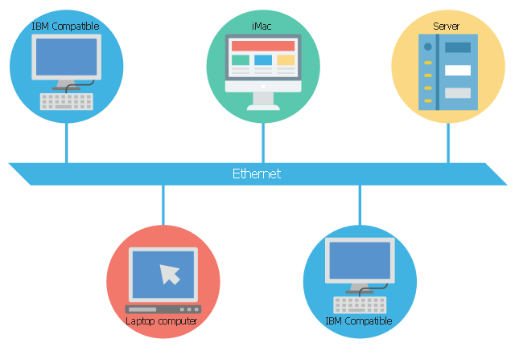

# Table of Contents

1. [Introduction](#intro-intro)
2. [Introducing TCP/IP 5-layer model](#5-layer-intro)
   1. [Physical Layer](#physical-layer)
   2. [Data link layer](#data_link_layer)
   3. [Network Layer](#network_layer)
   4. [Transport Layer](#transport_layer)
   5. [Application Layer](#application_layer)
   6. [OSI model](#osi)
3. [The Basics of networking devices](#basics)
   1. [Cables](#cables)
   2. [Network Devices](#network_devices)
      1. [Hub](#hub)
      2. [Network Switch](#network_switch)
      3. [Routers](#routers)
      4. [Sever and clients](#client_n_server)
4. [OSI model](#osi)

# Introduction

1. protocol
   * defined set of standards computers must follow to communicate
2. Computer networking
   * full scope of how computers communicate with each other

# Introducing the TCP/IP 5-layer model

## Physical Layer

* represents physical devices that interconnect computers
  * includes specs for
    * network-cables
    * connectors that join devices
    * how signals transferred over these devices(cables+connectors)

## Data-Link Layer

1. also known as network-interface or network-access layer.
2. defines a common way of interpreting these signals so network devices can communicate
3. **ethernet** is a protocol that belongs to this layer
   1. it defines protocol that gets data to nodes on the same network or link.
       

## 

## Network Layer

* also known as the *internet* layer
* allows different networks to communicate with each other using devices called *routers*.
* **Internetwork** - collection of networks interconnected through routers.
  * for eg. the internet
* data delivered across a collection of networks.
* most common protocol at this layer - **IP(internet protocol)**
* network software = Client + Server
  * client initiates request for data
  * server answers request, fetches some data aptly.

## Transport Layer

* sorts out which client/server programs are to receive the data.
* for eg. from ur device(laptop) multiple apps opened, for eg facebook.com, instagram.com , hence your laptop has multiple-clients, and their respective servers might run on the same server.
  * the request for facebook(for instance, posting a meme on a particular group) and request for following someone on instagram ends up exactly in their apt client spaces, i.e. request for instagram isn't received by the facebook client or vice-versa.
* TCP - transmission control protocol used.
  * provides mechanisms to ensure data is reliably delivered to the apt client/server.
* UDP - user datagram protocol.

## Application Layer

* application specific
* for instance, browsing sites - HTTP/HTTPS

# OSI model

* 7 layers

# Basics of network devices

## Cables

* copper or fiber cables.

1. <u>***Copper Cables***</u>:
   1. most common
   2. copper wires + plastic insulator
   3. voltages changes along these wires, that signals the binary 1's and 0's.
   4. Cat5, Cat5e, Cat6 most common
      1. Cat - category
      2. each has its own specs
      3. Cat5 mostly replaced with Cat5e/Cat6
   5. Cat5e
      1. reduced crosstalk, when compared to Cat5
         1. **Crosstalk**
            * electric pulse on one wire detected *accidentally* on other wire.
            * higher level protocols have methods that detect missing data and "ask for data again", but this increases time of service.
   6. Cat6
      1. more strict specs that Cat5e, hence even lesser crosstalk than it.
      2. more expensive than Cat6
      3. more reliable and faster data transfer than Cat5e
      4. shorter maximum distance, when used at higher speeds, due to internal arrangement of wires 
2. <u>***Fiber Optic Cables***</u> : 
   1. individual optic fiber cables(tiny tubes made out of glass)4
   2. transport pulses of light(1's and 0's), rather than electric signals.
   3. can be used in an area of high electromagnetic interference
      1. this can impact Cu-electric signal data transmission.
   4. usually quicker data transfer than Cu-cables.
   5. much more expensive and fragile.
   6. longer distances, without potential data loss
   7. used more at data-centres, than at offices/home.

## Network Devices

### Hub

* allows connections from many computers at once.
* devices connected to hub able to talk to other devices connected on the same hub.
* 
* **collision domain**
  * network segment where only 1 device can communicate at a time
  * if multiple systems try communicating, then signals can get mixed at the hub
    * this is data collision
    * in such scenario, all workstations have to wait for a period of time, before any one of them can start communicating again
    * this slows down network communications
    * this is the *reason* why *hubs* are *fairly rare.*

### Network switch

* 
* this is actually a layer-2 , i.e. a **data-link layer** device.
* inspect constance of an ethernet protocol data sent around the network, determine which system the data is intended for, send data to that system only.
* reduces/in some cases completely eliminates size of collision domains

### Routers

* hubs and switches primarily used in LAN.
* knows how to forward data between independent networks
* operates at layer-3, i.e. **Network layer device**
* inspects IP data to know to which system to send a particular piece of data.
* stores tables containing information on how to handle traffic between different networks
* most common- home/office routers
  * not much detailed tables
  * forward traffic to ISP(internet service provider)
  * a more sophisticated router at ISP handles, these are referred to as *<u>core ISP routers</u>*
  * core ISP routers make complex decisions on where to send the traffic.
  * connected to a variety of routers
* **Border Gateway Protocol**
  * routers share data via this
  * lets them learn about the most optimal paths to forward the traffic to.

### Servers and Clients

* each client/server - node on the network
  * client - requests for data(can be a node/program running or node)
  * server - provides the requested data(can be a node/program running or node)
