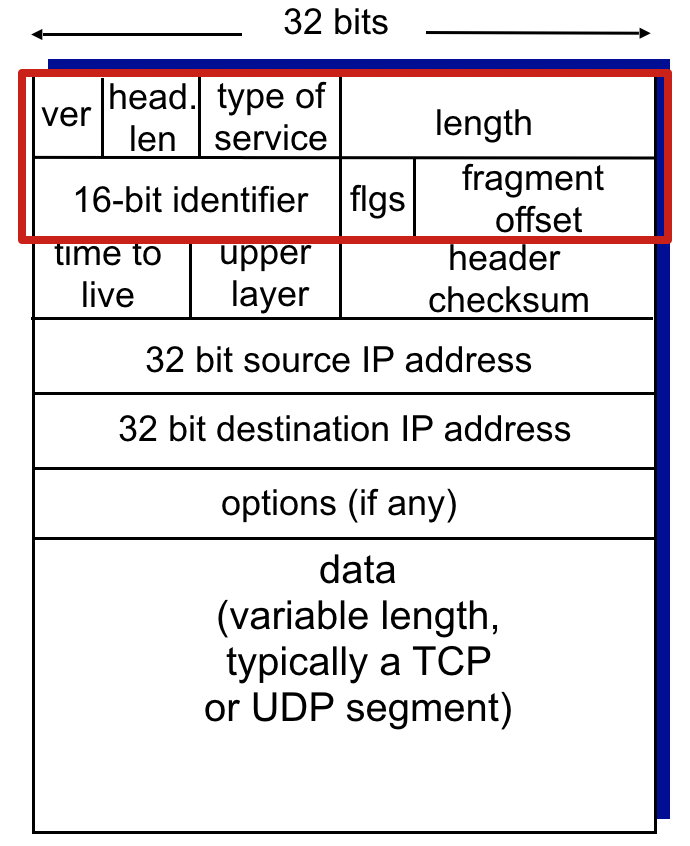
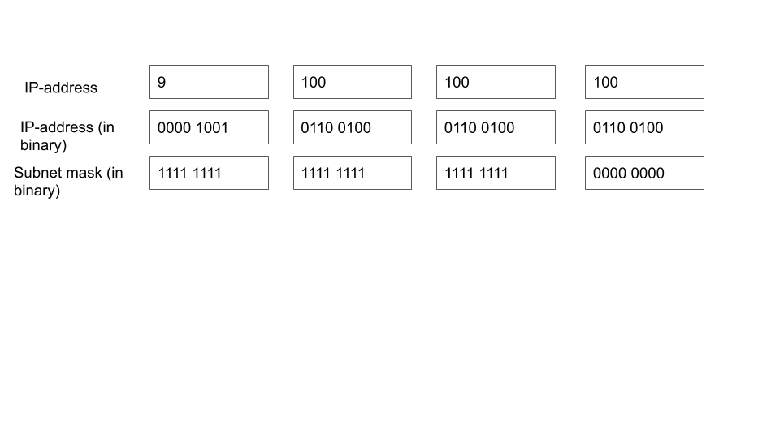
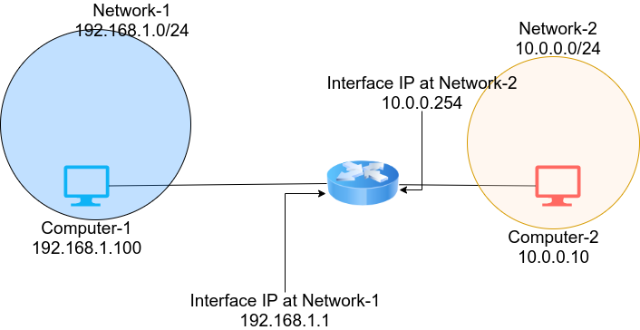
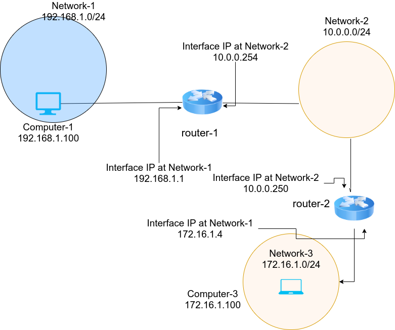
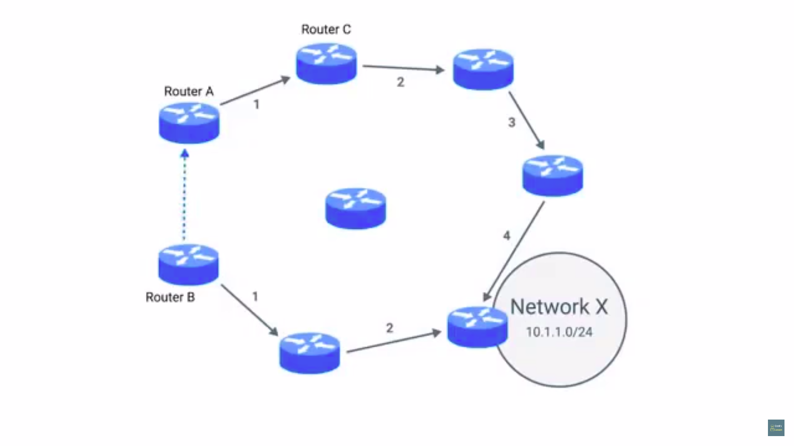
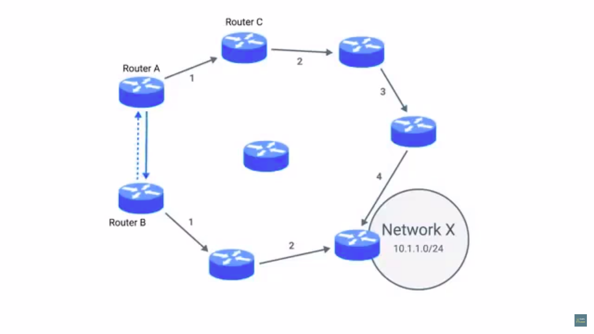

# Table of Contents

1. [IP-address : Introduction](#ip-intro)
2. [IP datagrams](#ipdatagrams)
3. [IP addresses](#ip_addresses)
4. [Address Resolution Protocol](#arp)
5. [Subnetting](#subnetting-intro)
   1. [Subnetting](#subnetting)
   2. [Subnet Masks](#subnet_masks)
   3. [CIDR](#cidr)
6. [Routing](#routing)
   1. [Basic routing concepts](#routing-concepts)
   2. [Routing Tables](#routing-table)
   3. [Interior gateway protocols](#igp)
   4. [Exterior gateway protocols](#egp)

# IP-addresses : Introduction

1. 172.16.254.1 - 32 bit or 4 bytes , each of these dot-separated numbers represented as 8 bits
   1. hence if any of these 4 numbers is > , then that is an invalid ip address.
   2. this notation = dotted decimal notation
2. distributed to companies, rather than manufacturers/hardware vendors
   1. more hierarchical , easier to sort data about
   2. for instance, IBM owns everything that has its IP's  1st decimal as 9
   3. thus if a router has to deliver a packet to 9.0.0.1, then it has to deliver this to any IBM router, and then this IBM router will take over.
3.  thus  laptop = permanent MAC, but variable IP(depending upon the network its connected to)
4. LAN at home/internet cafe responsible for handing over an IP address to your laptop
   1. similarly how at CCNSB lab, each port
   2. automatic assigning of this IP address to a connected system - DHCP(dynamic host configuration protocol), an IP address assigned in this fashion - *dynamic IP address*
      1. assigned to clients(laptops/phones etc devices that connect)
   3. static IP - configured on a node manually
      1. reserved for network devices and servers

# IP Datagrams 

1. data-packets at the network layer
   
2. ver = version(4 bits) 
   1. what protocol is being used 
      1. version 4 = IPv4
      2. version 6 - IPv6
3. Header-length = 4 bit long
   1. tells length of the header field
   2. value is always 20 bytes(length of header = 20 bytes) when dealing with IPv4
      1. 20 B minimum length of an IP header
4. Service type field
   1. 8 bits -details about QoS(quality of service), technologies etc.
   2. services that allow routers to know which IP-datagams are more important than others.
5. Total Length
   1. 16 bits, indicate total length of this IP datagram
   2. hence, max size of datagram = 
   3. if data is even larger, IP layer splits the data being sent into packets
6. Identification field
   1. 16 bits
   2. used to group messages together
   3. if, as mentioned above, data is split into packets, this field is used so that the recipient understands every packet with the same value in this field is part of the same data being transmitted.
      1. hence, whichever packets(IP-datagrams) have the same identification field value belong to the same data.
7. Flag field
   1. indicate whether data is allowed to fragment
   2. indicate whether data has been fragmented.
8. Fragmentation
   1. split a single IP-datagram into multiple smaller datagrams
   2. network might allow different sized-datagrams to pass through
      1. hence if a large datagram enters a network where shorter datagrams are allowed only, this would be fragmented .
      2. fragmented offsets thus used
      3. this is used by the recipient to put all fragments datagrams together
9. TTL - time to live
   1.  8 bits
   2.  number of router-hops a datagram can traverse before its thrown away.
   3.  every time a datagram reaches a new router, this router reduces its TTL value by 1.
       1. once value = 0, no need to forward this further
   4.  misconfig in routing which leads to an infinite loop, datagrams don't spend infinite time roaming around various networks.
       1. infinite loop = for eg. router A thinks router-B is the next hop, router-B thinks router-A is next hop
10. Protocol
    1. 8 - bits
    2. which transport-layer protocol is being used.
11. Header Checksum
    1. checksum of entire contents of the datagram header.
    2. changes at every site where TTL field gets modified, i.e. entry into every new router.
12. Source & destination IP-address
    1. 32-bits each
13. IP options field
    1. characteristics primarily used for testing purposes.
    2. might be padded with 0's until this options+padding field reaches 32-bit length.
14. Data field
    1. variable length field
    2. carries actual data

Entire contents of an IP-datagram are ***encapsulated*** as the payload of an ethernet frame.

datagram has a payload section = TCP/UDP packet contents

# IP-addresses

1. network ID + host ID
2. 9.100.100.100 , 9 = network ID, 100.100.100 = host id

Address Class system

1. way of defining how the global IP address space is split.
2. class A, B, C
3. class A
   1. 1st octet = network ID, last 3 = host id
   2. host = 24-bit, thus max possible number of hosts for a class A IP =  (0-16,777,215) 
   3. 1st bit of 1st octet(think in terms of dotted decimal notation) = 0, hence remaining number of bits that can be arbitrarily set = 7, hence range of network IDs = 0-127
4. class B
   1. 1st, 2nd octet = network ID, last 2 = host ID
   2. 1st 2-bits of 1st octet(think in terms of dotted decimal notation) = 10, hence remaining number of bits that can be arbitrarily set = 6, hence range of network IDs = 128-191 (10[000000]-10[111111])
5. class C
   1. 1st 3 octets = network ID, last octet = host id
   2. host = 8 bits, max number of possible hosts = (0-255)
   3. 1st 3-bits of 1st octet(think in terms of dotted decimal notation) = 110, hence remaining number of bits that can be arbitrarily set = 5, hence range of network IDs = 192-223(110[00000] - 110[11111])
6. class D
   1. begin with 1110 , hence 224-239 (1110[0000] - 1110[1111])
   2. used for multicasting , hence a single IP-datagram can be sent to a network at once.
7. class E
   1. begin with 11110, hence 240-255 (11110[000] - 11110[111])
      1. unassigned, only used for testing purposes

This class system has been replaced by another system called CIDR(Classless inter-domain routing)

# Address Resolution Protocol

1. discover hardware address of a node with a certain IP address.
2. most network devices maintain an ARP-table
   1. list of IP and MAC addresses associated with them(of all the hardware devices that are associated with that network, since IP == network :: MAC == hardware).
3. suppose data sent to IP = 10.20.30.40, such that this doesn't have any entry in the ARP table
   1. node sends a [broadcast](#broadcast_m)  ARP  message(FF:FF:FF:FF) to all computers on the local network 
   2. if a network interface has this IP, it sends an *ARP response* , containing the MAC address of this recipient.
   3. now, both source and dest MAC are obtained, thus the ethernet frame is ready. 
   4. likely that this IP and MAC are stored in this ARP table.
4. ARP tables generally *expire after short amount of time* to ensure changes in network are accounted for.

# Subnetting

## Subnetting

1. large network split into smaller subnetworks, also called *subnets*.
2. core routers know 9.100.100.100 belongs to 9.0.0.0 with class A network
   1. message routed to gateway router, by looking at network ID
   2. as the name suggests, gateway router specifically serves as the entry and exit paths to a certain network.
   3. now this gateway router, by looking at the host ID field of the data packet, determines to which system the data packet is meant for.
   4. for instance, this class A  = 16.7M hosts, impossible to connect all 16.7M to the same gateway router, hence subnetting used
3. each subnet has its own gateway router, serving as ingres/egres point for each subnet

## Subnet Masks

1. subnet ID
2. from the bits of host-ID, some bits reserved for subnet-ID
3. hence IP == network+subnet+host ID
4. core routers look up for network ID only , at the internet level, use this to send the datagram to a particular gateway router
5. gateway router, using some info particular to it, sends this either to the destination machine directly, or to the next router
6. host ID used by the last router to send this datagram to the destination system
7. dotted-decimal/4-octet notation for these masks
8. 
9. the above has a subnet mask of 255.255.255.0 , subnet masks means which of the octets to ignore while computing the host ID, so if the corresponding subnet-mask octet is 255, ignore that IP-octet, hence 100 = host ID
10. the all 1's in the subnet mask tell the router the part of an IP is the subnet ID, hence 9.100.100 is  A PART OF the subnet ID
    1. since this is a class A system, the 1st octet belongs to network ID
    2. hence the 2nd and 3rd compose of the subnet ID
    3. hence 100.100 = subnet id
11. therefore , from an IP = 9.100.100.100 , network-id = 9, subnet-id = 100.100, host-id = 100, if ht esubnet mask = 255.255.255.0 
    1. not to mention, network+subnet-ID octets obtained from AND operating IP-address with subnet mask
    2. this is done by the system(computer) that receives this datagram, which then checks with its own network-ID, to check whether the address was meant for its network or not.
12. mask also determines the subnet size
    1. for a mask = 255.255.255.0, only the last ids are available for representing the host-IDs
    2. hence, size of subnet = total-host-ids possible - 2, i.e. subnet size for this mask = 254
    3. out of the total possible 256 numbers i.e. 0-255, 0(mask = 255.255.255.0) is generally not used and 255 is reserved as the broadcast message(subnet mask 255.255.255.255 is FF:FF:FF:FF in hexadecimal)
13. mask = 255.255.255.224 = [1]&times;8,  [1]&times;8, [1]&times;8, 1110 0000
    1. only 5 bits of host id space, 32 total addresses , out of which yet again, only 30 would be assigned.
    2. since this subnet mask = 27 1's + 5 0's , also written as */27* , hence the entire IP+subnet mask written as 9.100.100.100/27 

## CIDR

1. traditional subnetting(subnetting with IP-address class system) could not keep up with the growth of the internet
2. sizing for instance, for Class - C networks = 254 total hosts, not enough for many use cases
   1. class B has 65,534 as total number of hosts, which is again too large to maintain inside an ARP table
   2. many companies ended up with various class-C networks, routing table ended up with many entries that actually were routed up to the same place.
3. subnet masks used to demarcate networks
   1. **demarcation point** - points where a network/system ends and the other begins
4.  the "/" notation - CIDR notation (9.100.100.100/27 = used to represent both IP and subnet mask)
5. IP = 9.100.100.100 , mask = 255.255.255.0 ==> 9.100.100.100/24
   1. here no address class, hence only network+host IDs
   2. hence the network mask(255.255.255) tells use that network ID = 9.100.100, host-id = 100
6. CIDR allows networks themselves to be of different sizes
   1. in the address class system, the networks were of fixed sizes, with the subnets being of variable size.
   2. if a company needed more addresses than a class-C system can provide, they would need a 2nd class C system all together
   3. with CIDR, this will just become 255.255.254.0(an extra-bit of host-IDs means that the number of available host-IDs is doubled, think of the left-shift operator, 254 = 1111 1111 1111 1110, or rather the host bits have been changed from xxxx xxxx to x xxxx xxxx), hence 9.100.100.100/24 becomes 9.100.100.100/23
   4. hence now the routers in their routing table have to have only 1 entry to know which router to deliver the traffic to(is the datagram meant for), rather than earlier maintaining 2 entries for the aforementioned 2 Class-C systems required in case of excess demand of hosts.
   5. in addition to this , 2 class-C systems, total hosts = 254+254 = 508, whereas for a /23 CIDR total hosts = 510(excluding 0 and 255 as the host ID)

# Routing

## Basic routing concepts

1.  router = network device that forwards traffic, based on destination address of that traffic
2. atleast 2 network interfaces per router.
3. router receives data-packet at one of its interfaces
4. examines dest IP of this packet
5. looks up the destination network(network ID) in its *routing table*
6. forwards traffic to the destination/router closest to the emote network.(determined by additional info in the routing table)
7. 
   1. network-1 = network-id = 192.168.1 , number of allowed hosts = 2^{32-24}-2 = 254, out of which the host-id = 100 is taken by computer-1, host-id = 1 is taken by router-interface
      network-2 = network-id = 10.0.0 , number of allowed hosts = 2^{32-24}-2 = 254, out of which the host-id = 10 is taken by computer-2, host-id = 254 is taken by router-interface
   2. lets say that computer-1 wants to send data to computer-2
      1. this computer-1 knows that computer-2 is not on the same network as its own, hence computer-1 sends this ethernet-frame to its gateway's MAC, i.e. gateway router, i.e. router shown above
   3. router-interface 192.168.1.1 receives this since it sees that the destination MAC belongs to it(the router)
      1. this router strips off the data-link encapsulation(ethernet-frame header and ethernet-frame footer) , thus leaving only the IP-datagram
      2. now the router inspects the datagram header for finding the destination IP
      3. it finds that the destination IP = 10.0.0.10, looks up network-id in its routing table, finds network-2 having the same ID, 
      4. this router also has all the MAC addresses associated with network-2(10.0.0.0/24) in its ARP table
   4. the router duplicates this ip-datagram, after decrementing the TTL field by 1, calculates a new checksum value, encapsulates this datagram inside a new ethernet frame 
   5. the router sets its *own MAC address* as the source MAC for this ethernet-frame, and since the MAC(10.0.0.10) is present in this ARP table, it sets that as the destination MAC address.
   6. thus the packet is sent out from interface 10.0.0.254 , gets delivered to computer-2 .
8. 
   1. computer-1 knows 172.16.1.100 not on its network, send ethernet-frame to router-1
   2. router-1 looks up its table, knows quickest way to get to network-3 is via network-2 router 10.0.0.250
      1. this decrements the TTL field of this frame by 1, attaches source MAC as its own, destination MAC as that of router-2
   3. router-2 receives the datagram, knows from its look-up table that computer-2 is the destination, directly connected, forwards the packet to it, after decrementing the TTL field for the same.
9. core-routers are connected in a mesh of networks, there may be many paths to transfer data-packet at the final destination.

## Routing Tables

1. 4 columns - destination network

### destination network

1. all networks that a router knows about
2. network-Id + subnet-mask = either stored as IP+subnet mask or in CIDR notation

Catch-all entry - any IP for which no network listed. 

### Next-hop

1. IP of the next router that should receive the data intended for the destination IP.
2. = 0 means no additional hops needed, the datagram is in the destination network.

### Total hops

1. shortest path could update due to many circumstances, like intermediary routers going off , new routers introduced, links disconnected, traffic congestion could cause certain routes to be too slow to use.
2. keep track of how far away the destination(network) is.
3. if router receives updated information from other routers, it will know if it currently can find the best path.

### Interface

1. router has to know which of its network-interfaces should it forward a network traffic to

* usually millions of rows in a routing table, all must be went through for each packet, before proceeding to forwarding data to final destination.
* to communicate to each other, routers located at distance networks need to follow certain protocols, that decide the best path for data transfer to the destination
* 2 main categories for routing protocols - 
  * interior gateway protocols
  * exterior gateway protocols

## Interior Gateway Protocols

1. link state routing protocols

2. distance vector routing protocols

3. routers share info within a single autonomous system

   1. collection of networks that all fall under the control of a single network operator
   2. for eg a large company, having offices distant apart, that send info from 1 office to another
   3. for eg, an ISP, having many routers

4. | distance vector protocol                                     | link-state protocol                                          |
   | ------------------------------------------------------------ | ------------------------------------------------------------ |
   | old standards                                                | newer standards                                              |
   | distance = number of hops between each network listed in the routing table | each router has state of each of  its interfaces these interfaces could be connected to different routers or to other networks(systems belonging to a network) |
   | sends list to every neighbouring router                      | information of a router propagated to every other router on the autonomous system hence every router on the system knows every detail about every other router on the dame autonomous system |
   | vector = list of distances for this router w.r.t. every other router in its routing table | each router then uses algorithms to determine best path for a data packet, using this info. |
   |  router A believes that fastest way to communicate to network X is via router-C, thus 4 hops   but when router B comes into play, it has network X located at total-hops = 2 this routerB then passes this info to routerA,   which then updates its routing table to have network X at 3 hops away, using B as the intermediary router to forward the traffic that arrives as router A, when the destination belongs to network X. | require more memory and higher processing power for running the aforementioned calculations |
   | this way, routers dont have much information regarding the state of other routers outside of their neighbouring ones , hence a router might be slow enough to react to a change in the network much distant to it This is solved by **link-state protocol**. |                                                              |

## Exterior Gateway Protocols

1. routers representing the *edges* of an autonomous system
2. to share info across different organisations, these used
3. core internet routers need to know about autonomous systems in-order to properly propagate traffic
   1. getting data to routers at edge of an autonomous system = main goal of core-routers
4. IANA, internet assigned numbers authority - non-pofit that 
   1. helps manage IP address allocation and more
   2. autonomous system number ASN allocation = single decimal number, but 32-bit in length
      1. never needs to change, to denote more number of core-routers/networks in the system.
      2. core internet routing tables need to be updated to know what an ASN represents
      3. look up AS19604 = IBM  by humans once to know that this autonomous system belongs to IBM.

## Non-routable address space

1. IPv4 unsuitable, RFC1918 issue in 1996 , since lack of total IP-address space(only 4Billion ip addresses possible, w.r.t. IPv4 system)
   1. request for comments(RFC)
   2. networks defined as non-routable address space
      1. not all networks need to be connected to the internet
2. NRA - ranges of IP which can't be routed to(connected to)
   1. nodes on such networks communicate with each other, but no gateway routers attempt to forward traffic to this network. 
3. 3 primary ranges = 10.0.0.0/8 , 172.16.0.0/12, 192.168.0.0/16 = free to be used for by anyone for their internal network
   1. apt for being used within an autonomous system, but no global routing to these