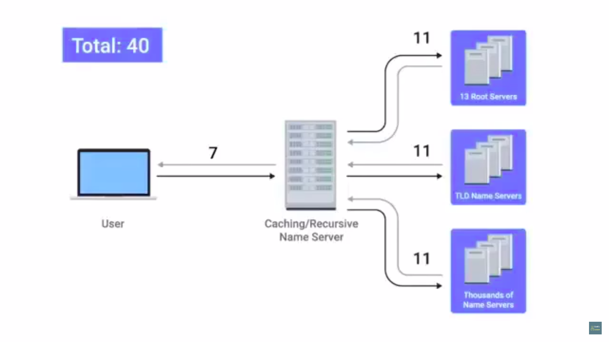
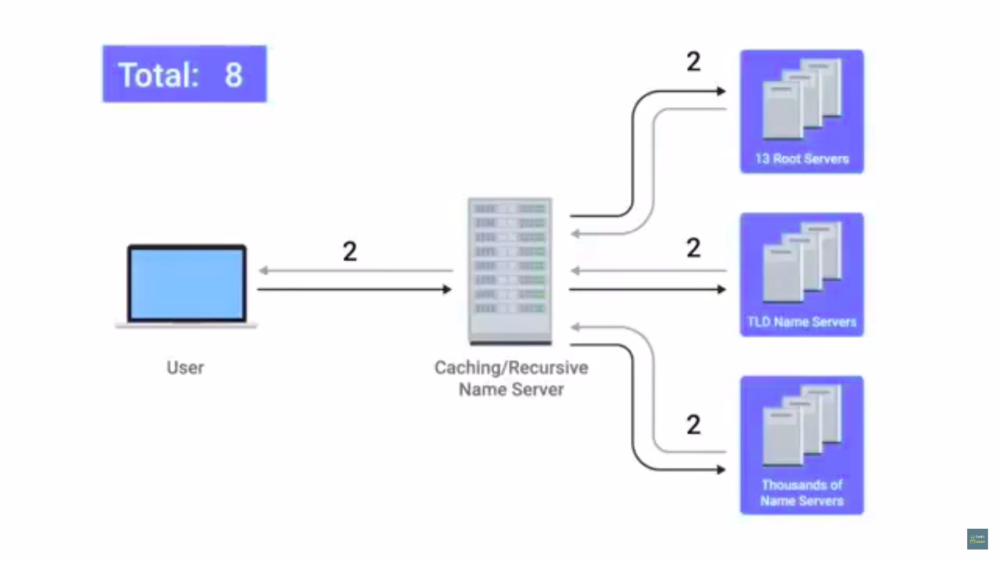

# Table of Contents

1. [Name resolution](#name-resolution)
   1. [Why DNS?](#dns)
   2. [The many steps of name resolution](#name-resolution-steps)
   3. [DNS and UDP](#dns-udp)
2. [Name Resolution in Practice](#name-resolution-in-practice)
   1. [Resource record types](#rrt)
      1. [A-record](#a-record)
      2. [quad-A record type](#aaaa)
      3. [CNAME record](#cname)

# Name resolution

## Why DNS?

1. domain name system - global, highly distributed network service that resolves strings of letters into IP-addresses. 
   1. done basically for human convenience, instead of remembering IP by ourselves, we remember the website name, like facebook.com, and the DNS actually has to remember to which IP-address this points to. 
2. domain name = something that can be resolved by the DNS
   1. an org can just change the IP a domain name resolves to without the knowledge of the end user
   2. this might come up, for instance, if the data-centre the org's website is hosted on is changing locations.
3. consider a global company, like facebook
   1. it would be a faster service if IP's related to facebook.com can be resolved to local data-centre servers
   2. DNS helps provide this, as it lets orgs decide to which IP should a domain name resolved to,given the geographic location of the request
   3. hence ,  consider 2 people sitting at NY, Delhi, requesting facebook.com, both there requests are resolved to different IP's , all thanks to DNS.

## The many steps of name resolution

1. using DNS to turn a domain name into an IP = name-resolution
2. DNS servers specifically configured at a node on a network, just like IP,  subnet mask and gateway host(router).
3.  types of DNS servers
   1. Caching name
   2. Recursive name
   3. Root name
   4. TLD name
   5. Authoritative name
4. Caching & Recursive name servers generally provided by an ISP for LAN
   1. their purpose is to store known domain name look-ups for a certain amount of time.
   2. to prevent resolution of a domain name for each new TCP connection, caching name servers used(that's why the name *caching name*)
   3. most caching name are also recursive name servers
   4. recursive name servers perform full DNS resolution requests
   5. usual local name server will act as both.
5. fully recursive resolution performed when a domain-name requested to the domain-name server, for eg. if the website facebook.com is requested
   1. now this IP is stored in the cache of this DNS as well as returned to the IP that requested this domain-name.
   2. if it already had an entry cached w.r.t. the domain-name entered, it will return the IP itself in return , without performing any recursive searches.
6. all domain names have a TTL field(time to live)
   1. value **in seconds** configured by owner of the domain name for how long a name server is allowed to *cache the entry before discarding it* and performing a full resolution again
   2. earlier since the general bandwidth available was far less, allowed TTL values could range to a max of 1 day
      
   3. now-a-days, TTL most domain to few minutes/few hours
7. on requesting a domain server, the recursive server contacts a root-name server
   1. 13 total root-name servers, responsible for directing queries to apt TLD name servers.
   2. in the past, these 13 root-name servers were distributed across very specific geographic locations
   3. but today, distributed across the globe via **anycast**
   4. **Anycast**
      * route traffic to different destinations depending on factors like location, congestion or link health
      * comp can send datagram to a specific IP but could see it routed to one of many different actual destinations
   5. there are actually *13 authorities that provide root-name look-ups* as a service, there aren't actually 13 physical root-name servers.
8. root servers will respond with the TLD name server that should be queried
9. TLD = top-level-domain
   1. last part of any domain name
   2. .com = TLD
   3. for each TLD a TLD name server exists(global distribution of anycast accessible servers responsible for each TLD)
   4. TLD name servers respond with a ***REDIRECT*** , informing the computer(that requested for the website), to which authoritative-name server to contact to.
10. authoritative servers are responsible for last 2 parts of any domain name, for instance for www.facebook.com, the TLD will point towards look-up for facebook.com , which is obviously controlled by facebook's servers
    1. after the comp contacts the authoritative servers the authoritative server returns the IP of the server in question
11. this was the *full resolution look-up*
12. usually the local computer / desktop will also have a local DNS cache

# DNS and UDP

1. DNS - application layer service that uses UDP at the transport layer
2. can generate a lot of traffic with TCP-usage
   1. if suppose TCP would have been used, SYN,SYN/ACK,ACK between requesting computer and cache/recursive name server, request for the domain-name www.facebook.com , caching name server responding with ACK, 5 packets right now
   2. SYN,SYN/ACK,ACK between cache/recursive name server and root-name server, followed by request for  TLD-name server, ACK from the appropriate TLD-name server, response from the same and ACK from caching/recursive-name  server,  ended by a 4-way handshake that ends this TCP connection between root-name and recursive-name server. This accounts for 11 packet-transfers.
   3. again 11 transfers between caching-name servers and TLD-name servers and 11 more between recursive-name and authoritative-name server
   4. hence a total of **38** data-transfers
   5. now this caching/recursive-name server sends response to the computer that requested for the domain-name, and this in turn sends out an ACK. 
   6. hence 2 more transfers are added, followed by a 4-way handshake for closing TCP connection between user-computer and its local name-server
   7. hence **a total of 44 data-packet transfers**.
   8. 
3. comparatively very less traffic with UDP-usage
   1. request for the domain-name www.facebook.com 
   2. cache/recursive name server asks root-name server, followed by response from the latter.
   3. caching-name server sends a packet to TLD-name servers and receives a response containing the correct authoritative server
   4. now this caching/recursive-name server sends final request to this authoritative server which sends a response containing IP for the website requested
   5. finally the local name-server responds to the computer that made the request with the above IP in its response.
   6. **a total of 8 data-packet transfers**.
   7. 
   8. DNS resolver asks again in case of no responses from either of the servers that it makes requests to(root-name/TLD-name/authoritative-name)
4. communication using UDP usually involves all responses being conveyed in a single data-packet
   1. but communications that could involve large data wouldn't fit in 1 UDP segment
   2. hence the DNS server would respond with a packet that tells that the "response is itself too large" 
   3. hence the DNS client will then establish a TCP connection, for using multiple TCP-segments.

# Name Resolution in Practice

## Resource record types

1. DNS operated with a defined set of these, they allow different resolutions to take place
2. most common = A-record

### A-record

- used to point a certain domain-name to a certain IPv4 IP-address
- DNS resolver asks for an *A-record* for a domain-name.
- 1 A-record configured for 1 domain name, but 1 domain name can have multiple A-records
- hence DNS round robin to be used to balance traffic across multiple IP
  - full-recursive resolution retrieves multiple-IP's for the same domain-name request, for instance www.facebook.com returns 10.1.1.1, 10.1.1.2 , 10.1.1.3 and 10.1.1.4
  - the DNS resolver(inside the computer) on look-up will assign 10.1.1.1 assuming that all the IP's arrived in the above mentioned order, it being the first entry.
  - it knows about all 4(i.e. doesn't throw out the other IP-responses) just in case connection with this IP fails
  - the next computer that looks up www.facebook.com will also receive all the 4 IP's(from cache) but in the order 10.1.1.2, 10.1.1.3, 10.1.1.4 and 10.1.1.1 . this is the round-robin queue 
  - this cyclic pattern continues every-time an DNS name resolution occurs.

### Quad-A record type(AAAA)

* returns an IPv6 address instead of IPv4 address(es)

### CNAME record

* redirect traffic from 1 domain to another
* www.facebook.com and <u>facebook.com</u> should be redirected to proper IP's belonging to those of facebook.
* by configuring a CNAME record for facebook.com that resolved to www.facebook.com , the resolving client would know to perform a resolution attempt for *www.facebook.com* , as previously discussed. 
* CNAME = canonical name (change canonical name, i.e. www.facebook.com when updating )
* 