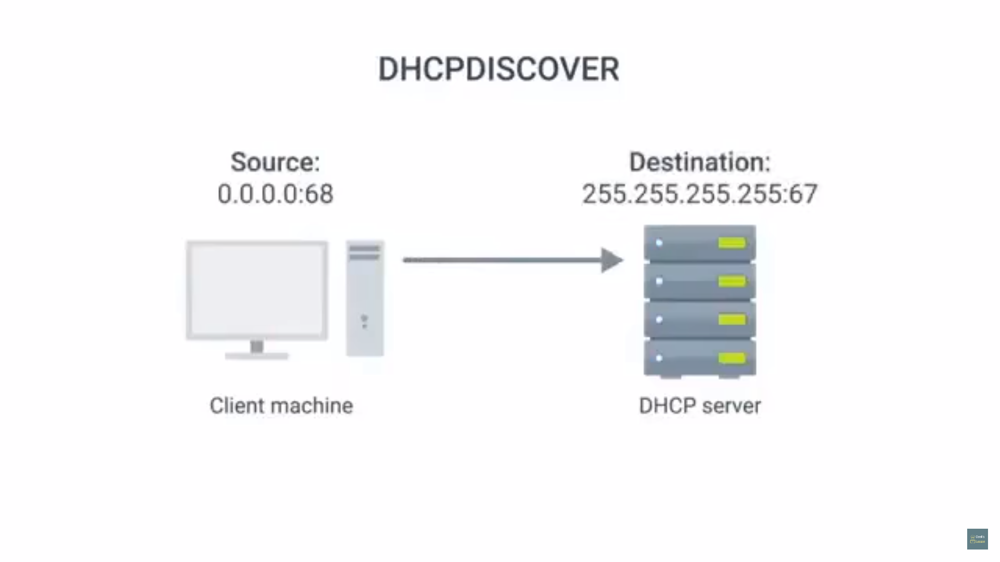

# Table of Contents

1. [Name resolution](#name-resolution)
   1. [Why DNS?](#dns)
   2. [The many steps of name resolution](#name-resolution-steps)
   3. [DNS and UDP](#dns-udp)
2. [Name Resolution in Practice](#name-resolution-in-practice)
   1. [Resource record types](#rrt)
      1. [A-record](#a-record)
      2. [quad-A record type](#aaaa)
      3. [CNAME record](#cname)
      4. [MX record](#mx)
      5. [SRV record](#srv)
      6. [TXT record](#txt)
      7. [PTR record](#ptr)
   2. [Anatomy of a domain name](#domain-name-anatomy)
   3. [DNS zones](#dns-zones)
3. DHCP
   1. [Overview](#DHCP)
      1. [DHCP-dynamic allocation](#dhcp-da)
      2. [DHCP-automatic allocation](#dhcp-aa)
      3. [DHCP- Fixed allocation](#dhcp-fa)
   2. [DHCP working](#dhcp-steps)
4. [Network Address Translation](#nat)
   1. [Basics of NAT](#nat-basics)
   2. [NAT and transport layer](#nat-tl)
   3. [NAT, non-routable spaces and limits of IPv4](#nat-limits)
5. [VPNs and Proxies](#vpns-proxies)
   1. [Virtual Private Networks](#vpn)
   2. [Proxy services](#proxy)
      1. [Web-Proxies](#web-proxy)
      2. [Reverse proxy](#rev-proxy)

# Name resolution

## Why DNS?

1. domain name system - global, highly distributed network service that resolves strings of letters into IP-addresses. 
   1. done basically for human convenience, instead of remembering IP by ourselves, we remember the website name, like facebook.com, and the DNS actually has to remember to which IP-address this points to. 
2. domain name = something that can be resolved by the DNS
   1. an org can just change the IP a domain name resolves to without the knowledge of the end user
   2. this might come up, for instance, if the data-centre the org's website is hosted on is changing locations.
3. consider a global company, like facebook
   1. it would be a faster service if IP's related to facebook.com can be resolved to local data-centre servers
   2. DNS helps provide this, as it lets orgs decide to which IP should a domain name resolved to,given the geographic location of the request
   3. hence ,  consider 2 people sitting at NY, Delhi, requesting facebook.com, both there requests are resolved to different IP's , all thanks to DNS.

## The many steps of name resolution

1. using DNS to turn a domain name into an IP = name-resolution
2. DNS servers specifically configured at a node on a network, just like IP,  subnet mask and gateway host(router). a single DNS server may actually compose of multiple physical servers, so that if one crashes, DNS traffic would be directed to them.
3.  types of DNS servers
   1. Caching name
   2. Recursive name
   3. Root name
   4. TLD name
   5. Authoritative name
4. Caching & Recursive name servers generally provided by an ISP for LAN
   1. their purpose is to store known domain name look-ups for a certain amount of time.
   2. to prevent resolution of a domain name for each new TCP connection, caching name servers used(that's why the name *caching name*)
   3. most caching name are also recursive name servers
   4. recursive name servers perform full DNS resolution requests
   5. usual local name server will act as both.
5. fully recursive resolution performed when a domain-name requested to the domain-name server, for eg. if the website facebook.com is requested
   1. now this IP is stored in the cache of this DNS as well as returned to the IP that requested this domain-name.
   2. if it already had an entry cached w.r.t. the domain-name entered, it will return the IP itself in return , without performing any recursive searches.
6. all domain names have a TTL field(time to live)
   1. value **in seconds** configured by owner of the domain name for how long a name server is allowed to *cache the entry before discarding it* and performing a full resolution again
   2. earlier since the general bandwidth available was far less, allowed TTL values could range to a max of 1 day
      
   3. now-a-days, TTL most domain to few minutes/few hours
7. on requesting a domain server, the recursive server contacts a root-name server
   1. 13 total root-name servers, responsible for directing queries to apt TLD name servers.
   2. in the past, these 13 root-name servers were distributed across very specific geographic locations
   3. but today, distributed across the globe via **anycast**
   4. **Anycast**
      * route traffic to different destinations depending on factors like location, congestion or link health
      * comp can send datagram to a specific IP but could see it routed to one of many different actual destinations
   5. there are actually *13 authorities that provide root-name look-ups* as a service, there aren't actually 13 physical root-name servers.
8. root servers will respond with the TLD name server that should be queried
9. TLD = top-level-domain
   1. last part of any domain name
   2. .com = TLD
   3. for each TLD a TLD name server exists(global distribution of anycast accessible servers responsible for each TLD)
   4. TLD name servers respond with a ***REDIRECT*** , informing the computer(that requested for the website), to which authoritative-name server to contact to.
10. authoritative servers are responsible for last 2 parts of any domain name, for instance for www.facebook.com, the TLD will point towards look-up for facebook.com , which is obviously controlled by facebook's servers
    1. after the comp contacts the authoritative servers the authoritative server returns the IP of the server in question
11. this was the *full resolution look-up*
12. usually the local computer / desktop will also have a local DNS cache

# DNS and UDP

1. DNS - application layer service that uses UDP at the transport layer
2. can generate a lot of traffic with TCP-usage
   1. if suppose TCP would have been used, SYN,SYN/ACK,ACK between requesting computer and cache/recursive name server, request for the domain-name www.facebook.com , caching name server responding with ACK, 5 packets right now
   2. SYN,SYN/ACK,ACK between cache/recursive name server and root-name server, followed by request for  TLD-name server, ACK from the appropriate TLD-name server, response from the same and ACK from caching/recursive-name  server,  ended by a 4-way handshake that ends this TCP connection between root-name and recursive-name server. This accounts for 11 packet-transfers.
   3. again 11 transfers between caching-name servers and TLD-name servers and 11 more between recursive-name and authoritative-name server
   4. hence a total of **38** data-transfers
   5. now this caching/recursive-name server sends response to the computer that requested for the domain-name, and this in turn sends out an ACK. 
   6. hence 2 more transfers are added, followed by a 4-way handshake for closing TCP connection between user-computer and its local name-server
   7. hence **a total of 44 data-packet transfers**.
   8. 
3. comparatively very less traffic with UDP-usage
   1. request for the domain-name www.facebook.com 
   2. cache/recursive name server asks root-name server, followed by response from the latter.
   3. caching-name server sends a packet to TLD-name servers and receives a response containing the correct authoritative server
   4. now this caching/recursive-name server sends final request to this authoritative server which sends a response containing IP for the website requested
   5. finally the local name-server responds to the computer that made the request with the above IP in its response.
   6. **a total of 8 data-packet transfers**.
   7. 
   8. DNS resolver asks again in case of no responses from either of the servers that it makes requests to(root-name/TLD-name/authoritative-name)
4. communication using UDP usually involves all responses being conveyed in a single data-packet
   1. but communications that could involve large data wouldn't fit in 1 UDP segment
   2. hence the DNS server would respond with a packet that tells that the "response is itself too large" 
   3. hence the DNS client will then establish a TCP connection, for using multiple TCP-segments.

# Name Resolution in Practice

## Resource record types

1. DNS operated with a defined set of these, they allow different resolutions to take place
2. most common = A-record

### A-record

- used to point a certain domain-name to a certain IPv4 IP-address
- DNS resolver asks for an *A-record* for a domain-name.
- 1 A-record configured for 1 domain name, but 1 domain name can have multiple A-records
- hence DNS round robin to be used to balance traffic across multiple IP
  - full-recursive resolution retrieves multiple-IP's for the same domain-name request, for instance www.facebook.com returns 10.1.1.1, 10.1.1.2 , 10.1.1.3 and 10.1.1.4
  - the DNS resolver(inside the computer) on look-up will assign 10.1.1.1 assuming that all the IP's arrived in the above mentioned order, it being the first entry.
  - it knows about all 4(i.e. doesn't throw out the other IP-responses) just in case connection with this IP fails
  - the next computer that looks up www.facebook.com will also receive all the 4 IP's(from cache) but in the order 10.1.1.2, 10.1.1.3, 10.1.1.4 and 10.1.1.1 . this is the round-robin queue 
  - this cyclic pattern continues every-time an DNS name resolution occurs.

### Quad-A record type(AAAA)

* returns an IPv6 address instead of IPv4 address(es)

### CNAME record

* redirect traffic from 1 domain to another
* www.facebook.com and <u>facebook.com</u> should be redirected to proper IP's belonging to those of facebook.
* by configuring a CNAME record for facebook.com that resolves to www.facebook.com , the resolving client would know to perform a resolution attempt for *www.facebook.com* , as previously discussed. 
* CNAME = canonical name (change canonical name, i.e. www.facebook.com when updating )

pointing facebook.com to the correct IP could be done in 2 ways

* setup identical A-records for both facebook.com and www.facebook.com, but if the underlying IP ever changes, then we would need to update both their A-records, hence 2 updations per name-server.
* setup the CNAME record of facebook.com as www.facebook.com and A-record of www.facebook.com to the correct IP, this way, even if the underlying IP does change, only 1 update required per name-server, i.e. updating the A-record

### MX record

1. mail-exchange
2. in-order to deliver an email to the correct server
   1. usually companies have different servers that handle web-traffic and email
   2. in-order to redirect traffic from mails to the mailing server, this is used

### SRV record

1. service record
2. define location of specific services
3. MX record can be thought of as an SRV record for the service of mailing
4. return records of services like CalDAV = calendar and scheduling service

### TXT record

1. originally used to associate text with a domain name for human consumption
2. It is also often used in a more structured fashion to record small amounts of [machine-readable data](https://en.wikipedia.org/wiki/Machine-readable_data) into the DNS.
3. communicate configuration preferences about network services that we have entrusted other orgs to handle for our domain(outsourcing of network services themselves to other orgs for our domain).
   1. consider outlook, it handles email for colleges and companies, hence the *mailing service* for different domains is thus handled by Microsoft's outlook
   2. the TXT record would then be used by the DNS to convey additional info to an email
4. for instance, google uses TXT record for verifying domain ownership and ensuring email security
   1. hence it acts as an informative record for other services

### Pointer resource record

1. resolves an IP to a name
2. used in reverse lookup zone files

## Anatomy of a domain name

1. www.google.com ,  3 parts = www, google, com
2. TLDs like .com, .org, .edu, even country-specific TLDs like .cn(China), .in(India) , .de(Germany, Deutschland)
   1. vanity TLDs such as .museum and .pizza exist, since originally defined TLDs have become very crowded due to the massive growth of the internet
   2. ICANN (non-profit, internet corporation of assigned names and numbers) handles administration and definition of TLDs
      1. sister org to IANA, in combination handle global IP spaces and global DNS systems
3. domain = google, used to demarcate where control moves from a TLD-name server to a authoritative name server
   1. can be registered and chosen by any company/individuals, must all end in one of the pre-defined TLDs
   2. registrars hand out domain names, mostly after financial payment
4. subdomain = www , also referred to *hostname*, if only 1 host is assigned to it
   1. freely chosen and assigned by anyone who controls a registered domain
5. FQDN - fully qualified domain name , on combining the above 3 parts
6. a registrar = company that has an agreement with ICANN to sell un-registered domain names
7. DNS can support upto 127 domain-levels for a single FQDN
   1. hence we can have host.sub.sub.subdomain.domain.TLD
   2. each individual section can only be 63 characters long
   3. complete FQDN limited to 255 characters

## DNS zones

1. root-name servers comprise of the *root-zone*
2. each TLD-name server responsible for zone covering its TLD(smaller than root-zones)
3. authoritative server responsible for a specific DNS zone(more granular than TLD-zone)
4. zones don't overlap, for instance, the authority for TLD-name server for .com TLD doesn't encompass (the zone of TLD .com) the google.com domain(www.google.com authoritative server) , but actually ends at the authoritative server responsible for serving the IP of google.com
5. allow for easier control at multiple domain-levels.
6.  net-ADMINs split up resource records for a DNS into various zones to easily manage them
   1. if suppose a company, *example* has 3 offices - LA, paris, Shanghai, each with 200 employees and their desktops having unique names, this means management of 600 A-records, if 1 zone was used for configuration
   2. if instead it is divided into 3 zones, 1 for 1 office location, thus making it la.example.com, pa.example.com and sh.example.com, thus 3 sub-domains
      1. hence 4 authoritative name servers required, one to match example.com, and the other to match the zone-wise sub-domain
7. configured using <u>zone files</u>
   1. declare resource records for a particular zone
   2. SOA(start of authority) - declares name and zone of the name-server that this zone file is authoritative for
   3. NS = other name servers responsible for this zone(a TLD-name server or a caching server doesn't physically mean 1 server, it actually is a collection of physical servers, this is done in case one of them crashes, the traffic would then be redirected to the others, they may actually have their own FQDN and IP's)
   4. all other resource-record types mentioned earlier are also mentioned in this file
   5. other configs like default TTL
8. Reverse lookup zone files
   1. let DNS resolvers ask for an IP and get the FQDN associated with it returned(that's why *reverse*).
   2. in lieu of A and AAAA records, pointer-resource record declarations used

# Dynamic Configuration Host Protocol

1. 3 out of the 4, i.e subnet mask, gateway and name server mostly the same for each node on a local network, only IP is different
2. *application layer protocol* - automates config process of hosts on a network
3. on connecting a computer to a local network, it requests the DHCP server for all the networking config in 1 go.
4. also helps to choose IP-allocation to each host on a local network
5. for servers and network equipment which are most likely to remain static, like gateway routers, a  static and known IP is important
   1. the devices on a network need to know the IP of their network's gateway routers at all times 
6. static IP to be associated with each physical server of the DNS server, or else its inspection by net-ADMIN  to diagnose for problems pretty tough
7. solves the problem of having to maintain a list of IP for each node on the network

### DHCP-Dynamic allocation

1. range of IP is set aside for client-devices, one of these IP's issued as per request
2. IP of a computer different at different times

### DHCP-automatic allocation

1. range of IP's set aside for assignment purposes
2. hence a list of all available IP's matched to which physical device, to be stored by the DHCP server, along with the number of available IP's
3. hence the same IP will be assigned to the same device, if suppose the same device leaves and then joins the network, *if possible*

### Fixed allocation

1. manually specified list of MAC address and their corresponding IP's
2. hence a table that matched MAC to IP is stored
3. this table is looked for, and if an entry w.r.t. this MAC exists, IP-address returned
   1. the allocation might fall back to automatic or dynamic, if the entri <u>is not found</u>
   2. it might even (basic security measure )
4. this table is configured originally at the DHCP server

### Network Time protocol

1. DHCP also used for allocating these servers
2. keep all computers on a network synchronized in time

## DHCP in action

1. **DHCP discovery**  - process by which a client configured to use DHCP attempts to get network configuration information
   1. client sends a DHCP discover message and since the machine(computer which has the client) neither has an IP allocated to it, nor does it know the IP of the DHCP server, it sends a broadcast message to 
   2. DHCP listens(server) on a *UDP port 67* , and this DISCOVERY messages are always sent from UDP-port 68
      
   3. hence the DHCP message encapsulated in a UDP datagram, whose fields source-port = 68 and destination-port=67 are set. this is then encapsulated inside an IP-datagram with destination IP = 255.255.255.255, source-IP = 0.0.0.0,  and this broadcast message is delivered to every node on the LAN
   4. DHCP receives this, examines it configuration to decide whether to and what IP to return, which depends on the type of protocol used for IP-address allocation(dynamic, automatic, or fixed)
2. **DHCP OFFER** - response to the above discovery request sent as this, destination port = 68, source-port = 67, destination-broadcast IP = 255.255.255.255, source-IP = 192.168.1.1(actual IP of the DHCP server)
   1. this response is also <u>a broadcast message</u>, hence sent to all nodes of the network
   2. MAC of client that requested is stored in a field of this response, hence all nodes will examine this, and only the node whose MAC matches will set 
   3. a DHCP client(the computer that made the request) can reject this OFFER, since its possible for the DHCP client to be configured to respond to OFFER with an IP under a certain range
   4. 
3. **DHCP REQUEST** - DHCP client accepts the IP offered from DHCP server
   1. sent from 0.0.0.0 since the IP hasn't been assigned yet
   2. dest-IP = broadcast IP of 255.255.255.255, hence this is also a broadcast message
   3. 
   4. 
4. **DHCP ACK** - DHCP server responds with an acknowledgement message
   1. sent to a broadcast IP of 255.255.255.255(since IP hasn't been assigned yet)
   2. source-IP of the DHCP server, i.e. 192.168.1.1
   3. response of DHCP REQUEST broadcast i.e. this, is done after the MAC address match-step, just like DHCP OFFER.
   4. 
5. The DHCP client recognises this DHCP ACK by matching the MAC stored in the DHCP ACK response from the DHCP server.
6. now the DHCP client has all the configuration information of the DHCP server
   1. this config = **DHCP lease**, as it includes an *<u>expiration time</u>*
   2. once expires, the client has to *issue a new lease*, entire process from discovery step has to be repeated
   3. a client can also release its lease, which happens usually when it disconnects from the network  so that this IP becomes free to be assigned to other devices that might request for an IP. 

# Network Address Translation

## Basics of NAT

1. translation of IP-addresses into one another
2. allows a gateway(router/firewall) to rewrite the source IP of an outgoing IP datagram while retaining the original IP in order to rewrite it into the response
3. 
   1. A wants to communicate with a web-server on B(for eg. A requests for example.com which is hosted on B)
   2.  the ethernet frame generated passed onto the gateway router
      
   3. router is configured to perform NAT for all outbound packets
      
   4. as shown above, the gateway router, before sending the frame from its interface at network B, i.e. 192.168.1.1 rewrites the source-IP of the original datagram with its own IP from its interface at network B.
   5. hence when the frame arrives at comp-2 it would seem like the request came from the router and not something called comp-1.
   6. same goes with the response, it would seem as the router is the source for the response, since the response datagram would have the IP 10.1.1.1 instead of 192.168.1.100
4. this is called **IP masquerading** - important for security
5. here, the address space of network B was protected from network A and vice-versa, this is called **One-to-many NAT** 

## NAT and the transport layer

1. it may be that a single computer, i.e. a single IP makes multiple requests to its gateway router and this router also handles responses to this computer from the various responding servers , thus many socket connections are opened in between the requesting computer and the router, and in between the router and the responding servers
2. hence port allocation necessary so that no 2 packets getting transferred collide
3. **Port preservation**
   1.  source port chosen by client is the same port used by the router(the router establishes a socket with the web-server, and a connection(hence a socket) exists between router and the client computer)
   2. 49,102 to 65535 are the ephemeral ports that can be used for allocation
   3. 
   4. networking stack of the computer chooses port 51300 for the request
   5. once the packet is received by the router, it performs NAT and masquerades the computer's IP with its own IP from the network interface of the server's network, but it *leaves the source port the same*. It stores this data(mapping) in a table
      
   6. now, when traffic returns to the router, at the port 51,300 it knows to which IP to forward the traffic to , because of the entry created in a table
      
4. its still possible for 2 different computers on a network to choose the same port at the same time
   1. the router selects an unused port at random to use instead
5. **Port forwarding**
   1. specific destination ports configured to always be delivered to specific nodes.
   2.  process of intercepting data traffic headed for a computer's IP/port combination and redirecting it to a different IP and/or port. 
   3. program that's running on the destination computer (host) usually causes the redirection, in tis case the ADA-server jupyter-notebook's port-forwarding option, which then calls forth the main program for port forwarding.
   4. Normally, a network router will examine the header of an IP packet and send it to a linked and appropriate interface, which in turn sends the data to the destination information that's in the header.
   5. in port forwarding, the intercepting application (or device) reads the packet header, notes the destination and then rewrites the header information and sends it to a another computer - one that's different from the one intended. 
      1. hence, even if the client requests for facebook.com's public-IP server to access this website, after the router stage, the application running on this public IP server might point to another server with a private IP, by rewriting the IP of the header of this incoming datagram to that of this private IP server
      2. this secondary host destination(or as I refer to it, private IP server) may be a different IP address using the same port, a different port on the same IP address, or a completely different combination of the two.
      3. IP Address 10.0.0.1 sends a request to 10.0.0.3 on Port 80(public). An intermediate host—10.0.0.2—intercepts the packets, rewrites the packet headers and sends them on to IP Address 10.0.0.4 on Port 8080(private).
      4. The host, 10.0.0.4, responds to the request, sending it to 10.0.0.2. Then 10.0.0.2 rewrites the packet—indicating that the response is from 10.0.0.3—and sends it to 10.0.0.1
      5. As far as 10.0.0.1 is concerned, it has sent a request to 10.0.0.3 on Port 80 and has received a response back from 10.0.0.3 on Port 80.
   6. this adds an extra layer of security to network communications, while remaining transparent to the user
   7. used to keep unwanted traffic off networks
   8. allows network administrators to use one IP address for all external communications on the Internet while dedicating multiple servers with different IPs and ports to the task internally, i.e. one public-IP server that handles requests traffic at the gateway router, but many private-
      IP servers that actually serve and process these requests.
   9. hence services that actually are running on these *private IP-servers* and other computers on this company's network stay hidden

## NAT, Non-Routable Address Space and Limits of IPv4

1. IANA assigns address blocks to 5 different Regional Internet Registeries(RIRs)
   1. AFRINIC - Africa
   2. ARIN - USA, Canada , parts of Caribbean
   3. APNIC - Asia, Australia, NZ, Pacific Island Nations
   4. LACNIC - central and south America, parts of Caribbean not covered by ARIN
   5. RIPE - Europe, Russia, Middle East, portions of central Asia.
2. these RIRs are responsible for assigning IP address blocks to organisations within their geographic areas
3. [regional exhaustion of IPv4](https://en.wikipedia.org/wiki/IPv4_address_exhaustion#:~:text=RIPE NCC%2C the regional Internet,pool on 14 September 2012.&text=On 21 April 2017%2C AFRINIC,of its IPv4 exhaustion policy.)
   1. IPv6 eventually resolved this problem
   2. although implementing this worldwide will take some time
4. RFC1918 - ranges of IP which cannot be assigned permanently, hence free to be used
   1. in a local network, [non-routable addresses](../network-layer/README.md#nra) can be used internally, since no traffic will be routed to them
   2. hence no global collision when those IP addresses are to be used
5. NAT used alongside non-routable address spaces, so that a router with the same IP can represent many computers behind it
   1. Because the non-routable IP groups are not registered in internet router and domain name server tables, the local router assigns identifying code to the packet headers it receives from local machines. 
   2. The local router uses these identifiers to direct traffic from local computers and back to them. 
   3. Again, DHCP used to allocate these addresses as well.
   4. Non-routable addresses provide an additional layer of security.

# VPNs and Proxies

## Virtual Private Networks

1. allows extension of a private/local network to hosts that might not be on that local network
2. tunnelling protocol, similar to port-forwarding
3. provision personal computer with a virtual interface and an IP matching the address space of the company's network, thus the computer is now able to access resources from this network as if it was physically connected to it.
4. carry encrypted payload in the transport-layer which is actually a packet in itself
   1. this contains the actual message/response/request in the form of the actual ethernet frame, which would have been otherwise sent if the computer were to be connected to the network physically.
   2. except the encrypted payload, everything else is stripped off, followed by decrypting it and then this packet is sent out, after checking for proper encapsulation across the  network
   3. this is done by the *VPN server*
5. if used for company/proprietary needs, 2-factor authentication recommended, VPNs have to be highly secure
6. for site-to-site VPN , a router/specialised VPN device used to establish the VPN tunnel to the router of the local network or VPN device(server/service) of the same requested network
   1. hence, even 2 physically separated offices might act as 1 network(employee of LA can access contents from Paris office via this)

## Proxy services

1. server that acts on behalf of a client in order to access another service(sit in between clients and other servers)
2. anonymity, security, content filtering, increased performance

### Web proxies

1. in older days, web proxies used in organisations to increase performance
2. drive traffic of clients to a web proxy server, instead of redirecting it directly to the web-server that will process the request, generate an apt response
3. the proxy server itself was responsible to retrieve data from the web-server
   1. this data would then be cached, in case someone requests the same data again
4. now, caching individual web-pages don't provide much benefits, hence such proxy-system now found very rare
   1. also going to suppose your own facebook id, then visiting somebody else's login id, 2 caches, not useful
5. web proxy servers now are used for security reasons
   1. they decide which request from the client to entertain, and which to reject

### Reverse Proxy

1. might appear to be a single server to external clients but actually represents many servers living behind it
2. form of load-balancing
3. also used for decryption of messages, since reverse proxy servers specially built for having cryptography related hardware so that encryption-decryption of data and response can take place
