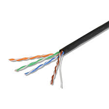
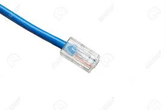
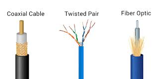
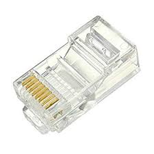
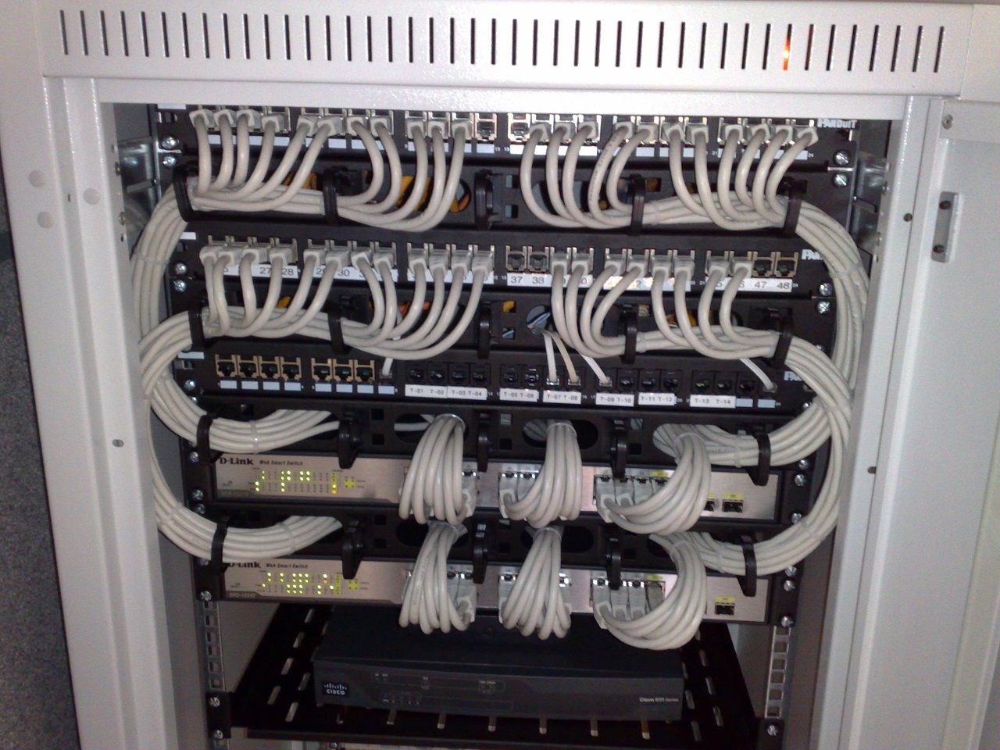

# Table of Contents

1. [Moving bits across a wire](#moving_bits)
2. [Twisted pair-cabling and duplexing](#duplexing)
3. [Network Ports and Patch Panels](#network_ports)
   1. [RJ45 plug](#rj45)
   2. [RJ45 port](#rj45_port)
   3. [Patch Panel](#patch_panel)

# Moving bits across the wire

* 1's and 0's sent across a Cu-cable through a process called modulation
* <u>Modulation</u>
  * varying the voltage of a charge moving across a cable.
  * w.r.t. computer networking this is called *line coding*
  * understands that electrical charge in a certain state  0, and in the other state = 1.
    
  * almost 10 billion pulses(bits) every second.

# Twisted Pair Cabling and Duplexing

* pairs of Cu-wires twisted together.
* twisted nature **prevents** signals being carried from **crosstalk** and external **electromagnetic interference**, from neighbouring pairs.
*  
* 4 twisted pairs inside a jacket(black insulation)
* allow duplex communication
  * information flow in both directions across a cable
  * 1-2 pairs of these 4 used for simplex(uni-directional communication), other 2 pairs used for communication is the exact opposite direction
  * hence devices connected can now communicate with each other at the exact same time, this is called **full duplex**
  * if something wrong with the connection, network link degrades reports itself as operating at  <u>half duplex</u> , here the devices on either side of the cable take turns communicating to each other.

# Network Ports and Patch Panels

* all network cables end up in a particular port/plug.
  * this plug exposes each individual wires.

Network ports:

* usually attached to the devices that make up the computer network
* switches have numerous network ports, servers/desktops usually 1/2.

## RJ45 plug

* registered jack, most common
* RJ45 plug 

## RJ45 network port

* this will usually have 2 LED lights - link light and activity light
* link LED will be lit if cable properly connected to a port, and its connected to 2 electrically powered ports on either sides
* activity LED lit up when data actively transmitted across the cable
* on switches, at times the same LED light is used for both
* such a port can usually be found either on cpu/laptop , or mounted in a wall.
* those mounted in a wall(college dorm LAN port) are connected on the other side to a **patch panel** 

## Patch Panel

* as is blatantly visible, this contains many network ports
* container for network port at your college dorm/desk