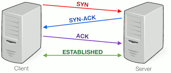
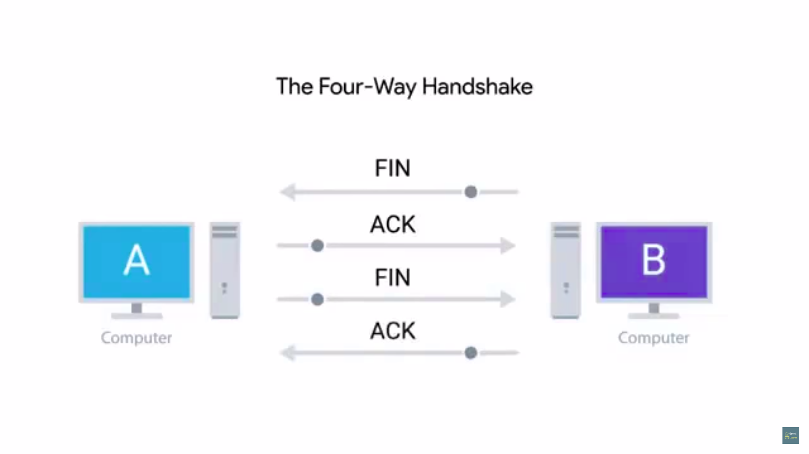

# Table of Contents

1. [Introduction](#intro)
2. [Dssection of a TCP segment](#dissecting-TCP-segment)
   1. [Source port](#source-port)
   2. [Destination port](#dest-port)
   3. [Sequence number](#sn)
   4. [Acknowledgement number](#an)
   5. [Data offset field](#offset)
   6. [Control flags](#control)
   7. [TCP window](#window)
   8. [TCP checksum](#checksum)
   9. [Urgent](#urgent)
   10. [Options](#options)
3. [TCP control flags](#control-flags)
   1. [3 way handshake](#3-way-handshake)
   2. [4 way hanshake](#4-way)
4. [TCP socket states](#socket-states)
5. [Connection oriented protocols](#cop)
6. [Connection-less protocols](#clp)
7. [Firewalls](#firewalls)

# Introduction

* allows traffic to be directed to specific network *applications*

- Multiplexing - nodes direct traffic to multiple services
- De-multiplexing - traffic meant for a node delivery at proper receiving service
- handled through ports = 16 bit , used to direct traffic to specific services running on a networked computer
- service = program running on a node, that awaits data request.
- different services run while listening on specific ports for incoming requests
  - traditional port for HTTP(un-encrypted) = 80
  - if a service requested, such that an instance of it runs on a computer with ip = 10.1.0.0, then this service is listening at the port 80, and the traffic for such requests is directed to this port.
- ip:port, hence 10.1.0.0:80 = socket-address/socket-number
- if the same device is running an FTP service
  - traditionally listens on port 21
  - hence traffic redirected to 10.1.0.0:80

# Dissection of  a TCP segment

1. IP datagram encapsulates a TCP segment
   1. inside the payload of an IP-datagram
2. TCP header + data section
3. 

## Source Port

* high-numbered port chosen from *ephemeral* ports.
* 16 bits
* needed to know whom to respond to w.r.t. a particular request made to a service
* specific to a client that makes the request, and not necessarily a computer
  * a computer could be potentially running many applications as the client, for eg. facebook, instagram etc.
  * for each client, for that PC, a specific port is assigned, so that a response from the facebook service is only received by the facebook client on your PC and not the instagram client for the same.

## Destination port

* port of the service a traffic is intended for(port at which the services *listens* for traffic)
* 16 bits

## Sequence Number

* 32 bit , in a sequence of TCP segments, where a particular TCP segment should exist
  * kind of like an index of an element of a list/array
* TCP splits response data into various segments, due to the max cap on ethernet frame payload, of 1500B
  * to keep track of all these *TCP segments* this field is used.

## Acknowledgement number

* number of the next expected segment
  * for instance seq-n = 1, ack-n = 2, means current segment is 1, and next expected segment = 2

## Data offset field

* 4 bits m length of TCP header for this segment
* so that recipient device knows where the payload begins

## Control flags

* 6 bits, each for 1 TCP control flag

## TCP window

* 16 bits, range of sequence numbers before an acknowledgement required
* it may so happen that seq-n  =1 ack-n = 5, then window = 4(0000 0000 0000 0100)

## TCP checksum

* 16 bit, just like at IP/ethernet level
* calculated across entire TCP segment, compared with this stored checksum value(
  checksum at TCP header), to check data was corrupted or not.

## Urgent

* used to point out which TCP segment more important
* used in conjunction with 1 TCP flag
* probably never find this in modern networking

## Options

* rarely used in real world
* used sometimes for more complicated flow control protocols
* will be padded to 32-bit length number

# TCP control flags

1. URG
   1. urgent flag
   2.  = 1, segment is urgent, urgent pointer has more data
2. ACK
   1. acknowledged
   2.  = 1, acknowledgement field should be examined
3. PSH
   1. push
   2. transmitting device wants receiving device to push currently-buffered data to the application on the receiving end ASAP.
   3. small amount of info , need the listening service to respond immediately
4. RST
   1. reset
   2. one of the 2 sides of a TCP connection hasn't been able to properly recover from a series of missing or malformed segments
5. SYN
   1. synchronize
   2. used when the TCP connection is established for the first time
   3. makes sure receiving end knows to examine the sequence the number field
6. FIN
   1. finish
   2. = 1, transmitting computer has no data left to send, thus close the TCP connection.

## 3 way handshake

1. 
2. computer A - transmitting, computer B - receiving
3. A sends TCP segment with SYN=1 to B
   1. establish a connection, look at this segment's sequence number to *know where the conversation starts*
4. B then responds with a TCP segment with SYN/ACK = 1
   1. ok, lets establish a connection, A's sequence number is acknowledged
5. A then sends a TCP segment with only ACK=1
   1. its acknowledges the fact that B acknowledged its request for TCP connection establishment
6. this is called **3 way handshake**
   1. **handshake**- a way for 2 devices to ensure that they are speaking the same protocol and will be able to understand each other
7. now all segments used for further communications should have ACK=1 so that the other side knows what has been received 

## 4-way handshake

1. 
2. used when the TCP connection is ready to be closed
3. B(request-maker/client) sends segment FIN=1
4. A acknowledges with an ACK=1
5. A(server) sends segment with FIN=1
6. B acknowledges with an ACK=1

### 

# TCP Socket states

* **Socket** - instantiation of an end-point in a potential TCP connection
  * instantiation - actual implementation of some object defined elsewhere
  * response for a request at a certain port, will be received only if a program has opened a socket at the requested port
* **LISTEN** - TCP socket ready to listen to incoming connections
* **SYN_SENT** - synchronisation request has been sent, but connection hasn't been established yet
* **SYN_RECEIVED** - socket previously in a LISTEN state has received a synchronisation request and sent a SYN/ACK (this is not or, but the second *handshake* of the 3-way handshake) back.
* **ESTABLISHED** - TCP connection is in working order, both sides free to send data to each other
* **FIN_WAIT** - a FIN has been sent but corresponding ACK from the other end hasn't been received yet
* **CLOSE_WAIT** - connection has been closed at TCP layer, application that opened the socket has not released its hold on the socket yet
* **CLOSED** - connection fully terminated, no further communication possible
* there are other states that exist
  * socket states name and definition vary from OS to OS
  * describing states of a socket at OS level not universal , rather is OS dependent
  * for troubleshooting purposes at the transfer layer, check socket states and their definitions for that OS.

# Connection oriented protocols

1. establishes a connection and uses this to ensure all data has been properly transmitted
2. resending data incase of data-loss detection, i.e. incorrect IP-datagram/ethernet-frame checksum value is handled by the transport layer
   1. when to re-send this data depends on TCP
3. TCP segments sent in a sequential order may not always arrive in the same order
   1. if suppose some of these segments had to be resent due to errors at lower layers
   2. sequence numbers then allow the data-packets to be arranged in the right manner
4. too many connection overheads w.r.t. 3-way handshake and the manner in which higher and lower layer communication occurs
   1. this creates extra traffic
   2. hence such protocols are used when one really really really has to be sure that data should be sent from A to B.
5. 

# Connection-less protocols

1. UDP - user datagram protocol
2. no concept of connections and acknowledgement
3. just set a destination and port and simply send the packet
4. useful for messages that are NOT SUPER-IMPORTANT
   1. for eg. streaming video
   2. video streaming will suffer only if a lot of frames fail to get transferred to destination port
   3. with UDP, the overhead from TCP connections(handshakes)  is eliminated, thereby higher quality videos can be seemingly streamed since more of the available bandwidth is used for data transfers rather than connection-establishment and acknowledgement.

# Firewalls

1. network device that blocks traffic that meets a certain criteria.
2. can function from blocking application traffic to blocking certain ranges of IP addresses.
3. most commonly used at transfer layer
4. block traffic to certain ports, allow traffic to some others.
5. 1 server hosts multiple network services, host website, also acts as a file server for confidential files w.r.t. to the company
6. firewall will allow any traffic meant for port 80, it could block access for external IP's(Not belonging to company's network system) to request at port 445 
7. for many companies & home devices, router+firewall = router, hence firewalls = program that can run anywhere
8. firewalls can run on individual hosts, rather than being a network device
9. major OS have this built-in, hence the blockage/allowance of traffic can be performed at host level as well.