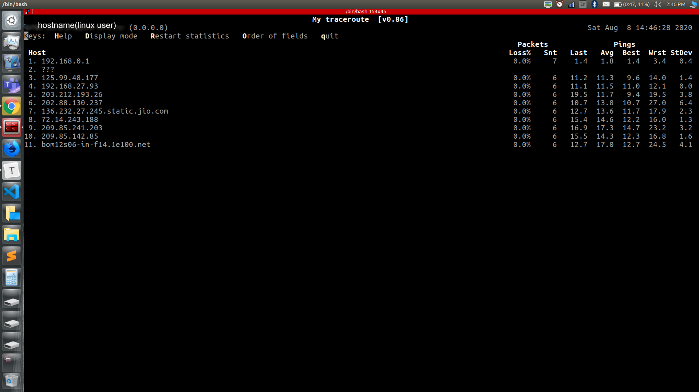
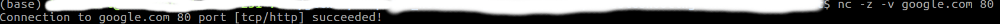
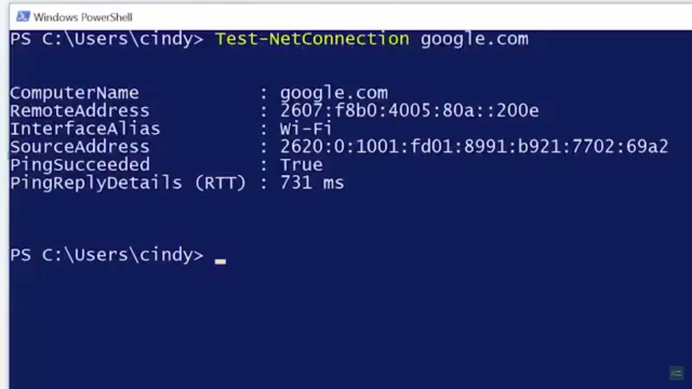
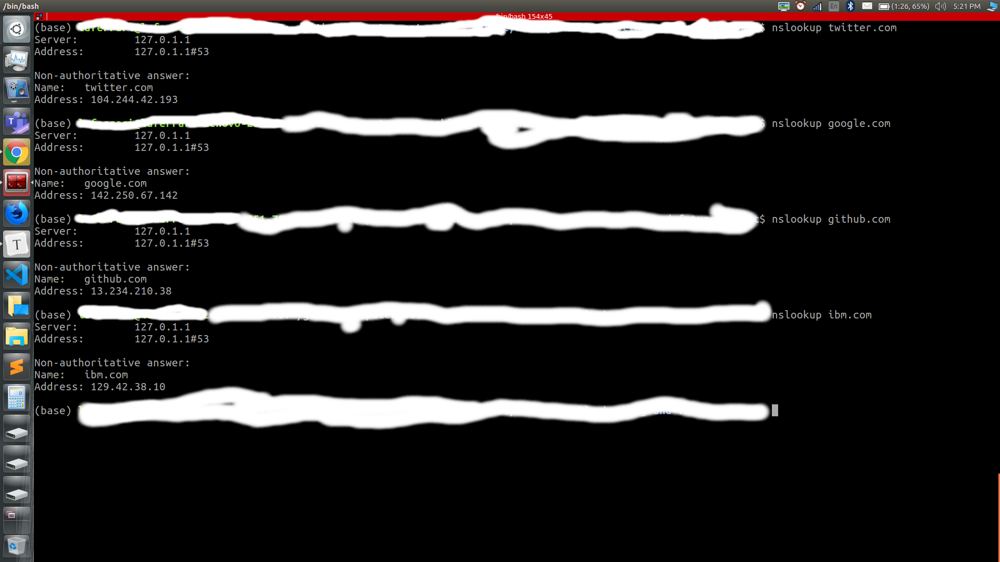
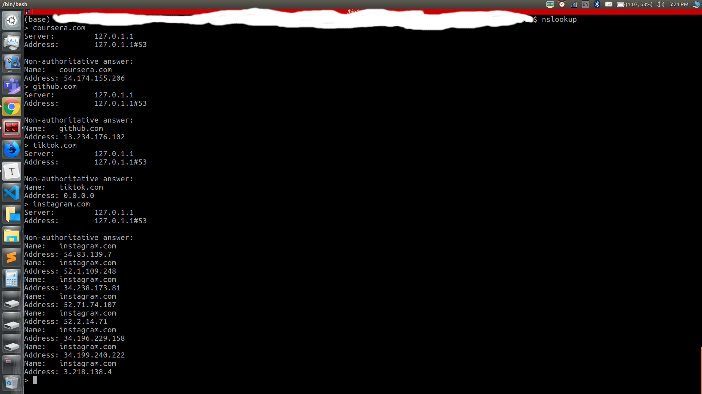
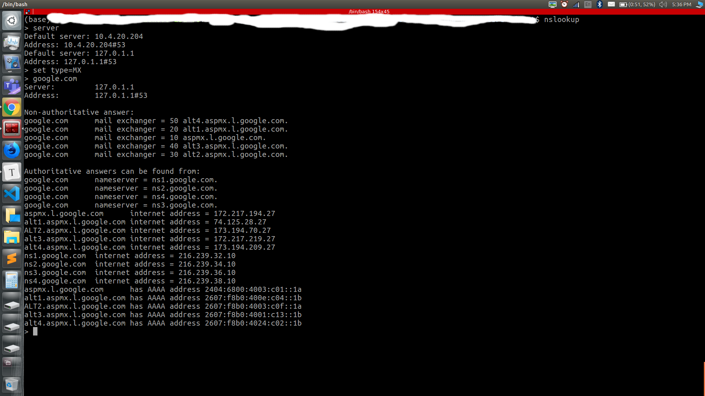
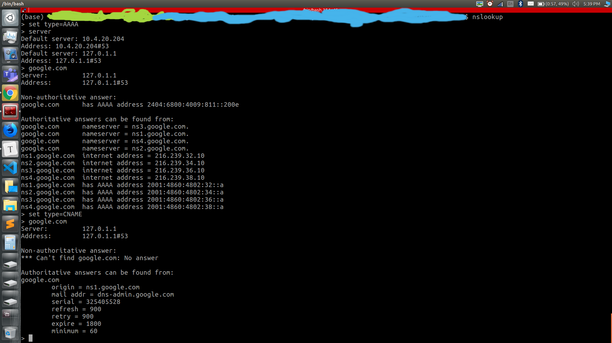
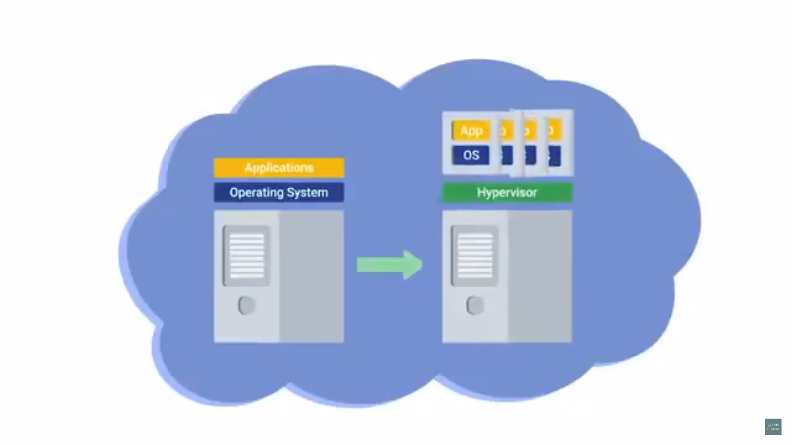
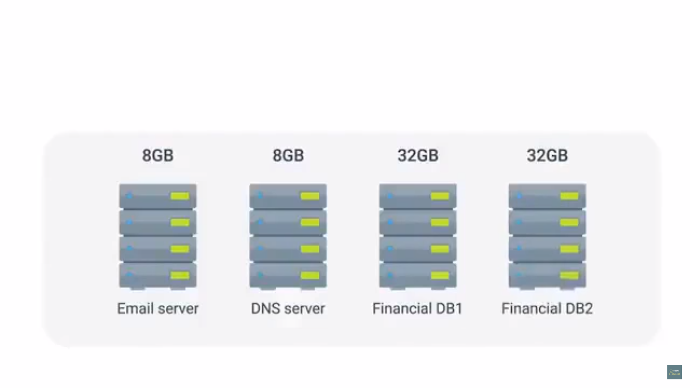
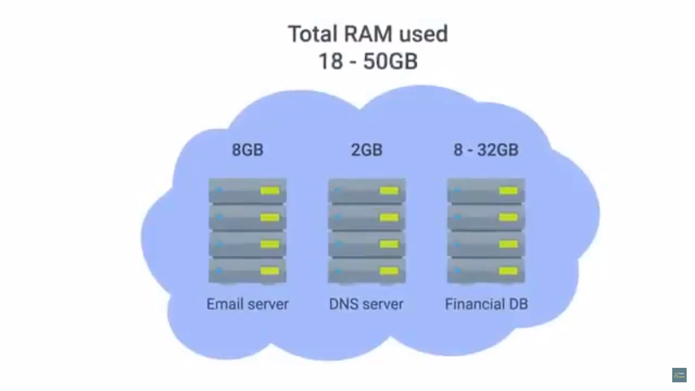

# Table of Contents

1. [Introduction](#intro)
2. [Verifying connectivity](#vc)
   1. [Ping : Internet Message control Protocol](#ping-icmp)
      1. [ICMP packet](#icmp packet)
         1. [Type](#icmp-type)
         2. [Code](#icmp-code)
         3. [Checksum](#icmp-checksum)
         4. [Rest of the header](#icmp-rest)
         5. [Data payload](#icmp-payload)
      2. [Ping](#ping)
   2. [Traceroute](#traceroute)
   3. [Testing Port Community](#tpc)
3. [Digging into DNS](#digging)
   1. [Name Resolution Tools](#nrt)
   2. [Public DNS servers](#pds)
   3. [DNS registration and expiration](#dre)
   4. [Host Files](#hf)
4. [The cloud](#cloud)
   1. [Introduction](#cloud-intro)
   2. [Private cloud](#private-cloud)
   3. [Hybrid Cloud](#hybrid-cloud)
5. [IPv6](#ipv6)
   1. [IPv6 addressing and subnetting](#ipv6-subnetting)
   2. [IPv6-datagram headers](#ipv6-header)
   3. [IPv4 and IPv6 harmony](#ip-harmony)


# Introduction<a name="intro"></a>

1. Error detection - ability of a protocol/program to detect and determine the error
2. Error recovery - an attempt to fix a detected error
3. for CRC - if mismatch, the data-payload is discarded, the transport layer then decides if the data should be resent


# Verifying Connectivity<a name="vc"></a>


## Ping : Internet Control Message Protocol<a name="ping-icmp"></a>

1. ICMP used to communicate issues like : TTL expiry of a segment/datagram/frame , router unable to route to a destination, port is unreachable and so on 
2. used by a router or a remote host to communicate why a transmission has failed, back to the origin of the transmission.


### ICMP packet<a name="icmp packet"></a>

1. header with some fields
2. data section, used by the host to figure out which transmission generated the error

#### Type<a name="icmp-type"></a>

1. 8-bits long, what type of message is being delivered
2. for eg. , *destination unreachable*, *time exceeded*

#### Code<a name="icmp-code"></a>

1. 8-bits, more specific reason for the message,  besides the type
2. for instance, for type=destination unreachable, codes = destination *network* unreachable, destination *port* unreachable

#### Checksum<a name="icmp-checksum"></a>

1. 16-bits

#### Rest of header<a name="icmp-rest"></a>

1. 32-bits, optionally used by some specific codes and types to send more data

#### Data payload<a name="icmp-payload"></a>

1. recipient could know which of the transmissions caused the error
2. entire IP-header and 1st 8 Bytes of the data-payload section of the offending packet(the packet that was sent for transmission but an error occurred)


### Ping<a name="ping"></a>

1. sends a special type of ICMP message called *echo request*
   1. "hey are you there?" is the human-conversational equivalent, i.e. the sender checks whether the destination is responding or not
2. if the destination is up-and-running and able to communicate on the network, it sends an *ICMP echo reply* message type
3. ping \<destination-IP\> or ping \<fully qualified domain name(FQDN)\>
4. the output = replying IP , size of ICMP packet, time of round-trip comms, TTL remaining. 
   1. once the command stops printing output and ends, number of packets sent, number received, % packets lost will also be displayed


## Traceroute<a name="traceroute"></a>

1. discover path between 2 nodes , giving information about each hop along the way

2. TTL = 1 for the first packet, 2 for the second and so on by this traceroute program

   1. hence the first packet makes it only to the 1st router, after which its discarded  , and the router replies with a ICMP-echo reply, the 2nd packet makes it only to the 2nd router, after which its discarded  , and the router replies with a ICMP-echo reply and so on.

3. for each hop, traceroute sends 3 identical packets

   ```bash
   traceroute <ip-address>
    # OR
   traceroute FQDN
   ```

   ```bash
   # outputs
   # n number of lines printed, if n is the total hops required to reach the destination
   <total-hops> <gateway-router IP> <roundtrip-time-packet-1> <roundtrip-time-packet-2> <roundtrip-time-packet-3>
   # the last line
   <total-hops> <host-name> <roundtrip-time-packet-1> <roundtrip-time-packet-2> <roundtrip-time-packet-3>
   
   # this hostname is only if traceroute is able to resolve
   ```

4. traceroute sends UDP packets to very high port-numbers, on UNIX and MACOS, on windows its name is **tracert** and it defaults to using ICMP echo request

5. mtr on linux and macos, pathping on windows, these act as long-running traceroutes

   1. here , **for mtr** in linux, this is similar to ping, as in the output of ping is endless, unless the program is exited, so is the output of mtr
   2.  
   3. it will update output everytime, and compute information on aggregated data


## Testing Port Connectivity<a name="tpc"></a>

tools to test connectivity at *<u>transport layer</u>* -  netcat(linux/macos) and test-net connections(windows)

### netcat<a name="netcat"></a>

1. `nc <host> <port>`, for eg, `nc google.com 80`
   1. if successful, command is still running with awaiting more input from the user
   2. if fails, command exits
2. send application-layer data to the listening service
3. `-z` flag is used if we just want to check status of the port(zero input output mode)
4. `-v` flag is used for verbose output
   


### Test-NetConnection<a name="tnc"></a>

1. `Test-NetConnection <host>`, for eg. `Test-NetConnection google.com`
2. functions like `ping` command, by sending an ICMP echo request, but it displays much more data
   
3. it displays the data-link layer protocol
4. `-port <port>` can be used to test connectivity to a specific port


# Digging into DNS<a name="digging"></a>

 

## Name Resolution Tools<a name="nrt"></a>

1. usually OS handles the name resolution for the local computer, but tools area available to examine the resolutions

2.  `nslookup` - most common tool for lookups, available for all the 3 OS's

3. `nslookup <hostname>` - output = which server was used for this request, and the resolution result
   

4. also has an interactive `nslookup` facility, just enter `nslookup` and press Enter.
   

5. using the `server` in this interactive session, we can view the default IP of the nameserver that our computer is using for requesting to connect to the hostnames that we enter, can `server <IP>` can let us change this default IP to `<IP>` given as an argument
   

6. by default, `nslookup` returns only the A-records, but in this interactive session, we can query for other records by using `set type=MX`, to view the MX records, similarly `set type=AAAA` for quad-A records
   
   

   

7. `set debug` can also be a command entered during this interactive session to view full response packets  , including all intermediary requests and all their contents


## Public DNS servers<a name="pds"></a>

1. an ISP usually gives you access to a recursive name server as part of the service it provides
2. using DNS as a service provider is getting popular
3. useful to have a backup DNS in-case current DNS service is not working
4. these can be used for free by anyone
5. most commonly used public DNS servers were run by *Level 3 Communications* , one of the largest ISPs , they actually sell connectivity to their network to other ISPs that deal with consumers
   1. IPs are 4.2.2.1, 4.2.2.2, 4.2.2.3, 4.2.2.4, 4.2.2.5, 4.2.2.6
6. google's public DNS - 8.8.8.8, 8.8.4.4
   1. officially acknowledged and documented by google, to be used for free by anyone
7. most public DNS available via multicast
8. use name servers provided by your ISP outside of troubleshooting scenarios.
9. also respond to ICMP echo request, hence their connectivity can be tested via `ping`


## DNS registration and expiration<a name="dre"></a>

1. initially a company, Network solutions Inc. = a registrar that was responsible for registration of almost all domains that were not country specific
2. after market growth and internet growth, USA government and Network solutions Inc. came at an agreement to let all other companies sell domain names
3. after domain-name registrations, either the registrar's name-servers could be used as authoritative servers, or you could configure your own authoritative servers.
4. can also be transferred from one party to another, from one registrar to another
   1. recipient registrar generate a unique string of characters to prove the domain-name ownership and whether the *donor* is allowed to transfer the domain-name or not
   2. this string usually configured as a *TXT record of your DNS server* 
5. after domain-name expiration, anybody could use them


## Host Files<a name="hf"></a>

1. flat-file on each line contains a network address followed by the host name it can be referred to as.

2. ```txt
   1.2.3.4 webserver
   ```

   user refer to webserver for accessing IP = 1.2.3.4

3. operated by the networking stack of the OS

### Loopback address<a name="la"></a>

1. way of sending network traffic to yourself
2. sending traffic to this address bypasses all network infra itself, hence traffic never leaves the node
3. for IPv4, this = 127.0.0.1
4. 
5. 127.0.01 localhost, followed by ::1 localhost,  where ::1 = loopback address for IPv6


host files are a popular way for computer viruses to disrupt and redirect user's traffic.


# The Cloud<a name="cloud"></a>


## Introduction<a name="cloud-intro"></a>

1. **Cloud computing** - technological approach where computing resources are provisioned in a shareable way so that lots of users get what they  need, when they need it
2. Hardware virtualisation - one of the main concepts that drive cloud computing, a single host able to run  many individual virtual instances, called guests.
3. **Hypervisor** - software that runs and manages virtual machines, while also offering these guests a virtual operating platform(virtual hardware) that's indistinguishable from actual hardware
   
4. 
   1. email server needs to run on windows, DNS to be run on linux, hence same physical machines can't be used, hence if we set the servers by ourself, we would need to buy 2 machines with these specs
   2. financial DB = 32GB RAM, which wont be needed at all times, just at the end-of-month for all billing related calculations, which are computationally demanding because of which machine with such high RAM is being chosen. , to be run on a special version of Linux, which is designed just for the DB .
   3. a second financial DB server is also bought as a backup
   4. hence 4 machines, with a total of 80GB RAM, out of which hardly 40GB will be used most of the times, hence huge money wastage for paying them, maintenance etc.
5. interconnected servers that can host virtualised servers
   1. 
   2. hence email+DNS+financial DB servers could all be virtualised
   3. need-based access would be provided to these virtual servers by the underlying physical ones
6. this could cost much less than the original deal


## Private Cloud<a name="private-cloud"></a>

1. used by a single large corporation and generally physically hosted on its own premises


## Hybrid Cloud<a name="hybrid-cloud"></a>

1. companies run things like sensitive proprietary technologies on a private cloud, while entrusting less-sensitive servers to a public cloud


# IPv6<a name="ipv6"></a>


## IPv6 Addressing and Subnetting<a name="ipv6-subnetting"></a>

1. internet protocol version 6
2. IPv5 introduced a concept of connections, it never really saw wide adoption and connection state was handled better by the transport layer
3. 128 bit address space, 3.402823669×10³⁸ 
4. 8 groups of 16 bits each
   1. each 16 bit entity is actually made of 4 hexadecimal numbers(each hexadecimal bit-length = 4)
5. full IPv6 = 2001:0db8:0000:0000:0000:ff00:0012:345
6. every IPv6 with starting : 2001:0db8 = reserved for documentation and education , or for books or courses, this amounts to 7.922816251×10²⁸
7. **Simplified Notations**
   1. can remove any number of leading zeroes from a group of an IPv6, so as to simplify it
   2. any two groups(16-bits each) which are consecutive and entirely 0000 can be replaced by **::** , but this should happen only once for a specific address, or else one wouldn't know how many 0's are replaced with :: 
8. 2001:0db8:0000:0000:0000:ff00:0012:345  &rightarrow;  2001:db8:0:0:0:ff00:12:345  &rightarrow;  2001:db8**::**ff00:12:345
9. ::1 is the loopback address in IPv6, i.e. 0000:0000:0000:0000:0000:0000:0000:0001
10. any address beginning as  
    1. FF00:: = used for *<u>multicast</u>* , i.e. addressing groups of host on the same network all at once
    2. FE80:: - link-local unicast addresses , allow for local network segment comms , are configured based upon a host's MAC address. 
       1. used by an IPv6 host to receive network configurations(like DHCP)
       2. hosts MAC address used to turn this 48 bit number to a 64 bit number
       3. inserted into addresses' host-ID
11. first 64 bits = network ID, last 64 = host ID
12. subnetting is used, along with the CIDR notation for IPv6 as well
    1. define a subnet mask against the network ID portion of an IPv6 address


## IPv6-datagram headers<a name="ipv6-header"></a>

1. the IPv6 datagram - 32 bits, 40Bytes
2. version - which version of IP is used, IPv4/IPv6, 4-bit
3. traffic class - 8 bit, type of traffic within an IP-datagram, different classes have different priorities
4. flow label = 20 bits for routers to assess quality of service-level for a datagram
5. payload-length field = length of payload = 16bits
6. next header = 
   1. since IPv6 much longer than an IPv4 address, more time to transmit this IPv6 data across a link, 
   2. to reduce this problem, take all optional fields and abstract it from the IPv6 header itself, 
   3. defines what IPv6 header occurs immediately after this header. 
   4. These headers are completely optional and thus not required for an IPv6 datagram
7. hop limit = 8 bit , identical in purpose to a TTL field
8. source, destination addresses = 128 bits each
9. data payload field of the length same as that specified in the payload-length field


## IPv6 and IPv4 harmony<a name="ip-harmony"></a>

1. direct shift to IPv6 system might be infeasible since there may be many devices that don't even know how to speak IPv6
2. **IPv4 mapped address space**
   1. 192.168.1.1 = 0:0:0:0:0:ffff:d1ad:35a7 , hence all translated IPv6 begin with first 80 bits = 0,  next 16 bits = 1, then the hexadecimal representation for the last 32 bits
   2. this represents an IP belonging to the mapped address space
   3. hence, an IPv4 traffic can travel over an IPv6 network
3. **IPv6 tunnels**
   1. tunnel servers take incoming IPv6 traffic and encapsulate it within traditional IPv4 datagram
   2. another tunnel server receives this and does the de-encapsulation, passes this IPv6 further along the network
   3. these are primary employed companies, since organisations by themselves can shift to IPv6 but changing the core of internet to IPv4 is highly infeasible.
4. **IPv6 tunnel broker**
   1. companies that provide IPv6 tunnelling end points for other people